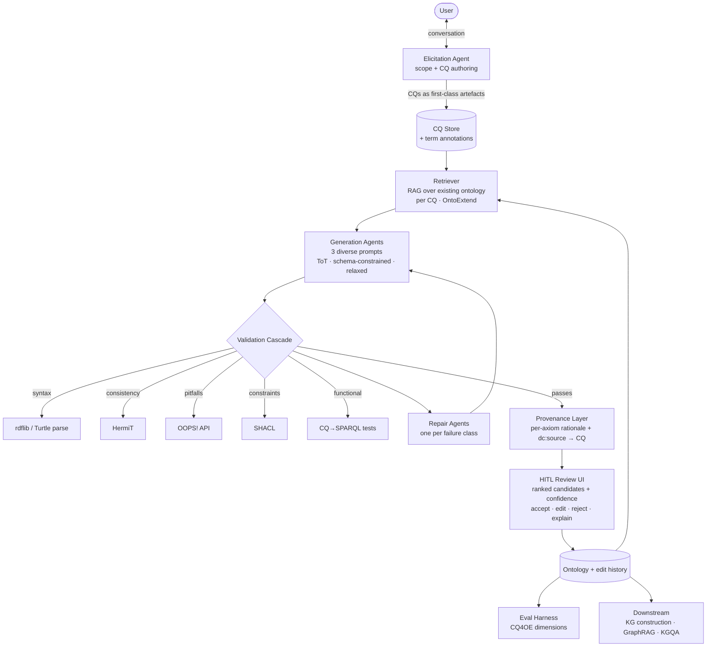

# SEMANTiCS 2026 — Trip Report & Research-Group Briefing

**Conference:** 22nd International Conference on Semantic Systems (SEMANTiCS 2026)
**Where/When:** Music Center De Bijloke, Ghent, Belgium · 15–17 September 2026
**Theme:** *"Bridging the Gap Between Curated and Induced Semantics"*
**Proceedings:** IOS Press, *Studies on the Semantic Web* Vol. 63, ISBN 978-1-64368-686-8, doi:10.3233/SSW63 — **Open Access (CC BY 4.0)**
**Conference site:** <https://2026-eu.semantics.cc/>
**Live community knowledge space (nanopublications):** <https://w3id.org/spaces/semantics/2026-eu>

> Status note: **Demo & poster papers are not published yet** — they will follow later. Workshop proceedings go to CEUR. The community also flagged that **slides are generally not shared**; worth checking back for a Zenodo community.

---

## 1. TL;DR — the five things that matter for us

1. **LLM-assisted ontology engineering has moved from "can it?" to "how do we evaluate it?"** The closing keynote (Daniel Garijo, UPM) was literally *"How good are Large Language Models at Ontology Engineering?"*, backed by two brand-new artefacts: the **CQ4OE benchmark** and the **MASEO** multi-agent generator. This is the single most directly competitive/complementary work to our KG Workbench.
2. **Competency Questions (CQs) are the de-facto interface between users and generated ontologies.** Every serious system at the conference (MASEO, OntoExtend, SoCK, SEOntology, CQ4OE) drives generation *and* evaluation from CQs. If our conversational agent doesn't elicit and manage CQs as first-class objects, we're off-trend.
3. **Nobody trusts single-shot LLM generation.** The winning pattern everywhere is **decompose → generate → validate with symbolic tooling → repair**, with named agents per stage and explicit provenance for every axiom. Validators used in the wild: **HermiT** (consistency), **OOPS!** (pitfalls), **rdflib/Turtle parse** (syntax), **SHACL** (constraints), **CQ-to-SPARQL** (functional tests).
4. **Human-in-the-loop is now a stated requirement, not a nice-to-have** — both for quality (Sabou's neurosymbolic keynote, OntoExtend's 6-engineer review) and for compliance (EU AI Act, AIRO, DQV4AI). "Humans remain stewards" was an explicit design principle in the enterprise-semantics session.
5. **Schema drift is the industrial killer.** Static, fine-tuned pipelines fail silently when ontologies evolve. Runtime schema discovery + agentic fallback (HARP) is the robust pattern. Our workbench generates evolving ontologies — so **every downstream consumer we build must be drift-tolerant by design.**

---

## 2. Keynotes

| Speaker | Affiliation | Talk | Why it matters to us |
|---|---|---|---|
| **Marta Sabou** | WU Wien | *Beyond Data: Why the Future of AI is Neurosymbolic* (NeSy workshop keynote, 14 Sep) | Trust = explainability + verifiability + alignment. Argues saliency-map-style explanations are useless unless **grounded in domain knowledge**. Missing pieces she named: **provenance** and **continuous AI system auditing**. Projects: SENSE (smart grid RCA), PERKS (procedural knowledge, KG + HITL validation + user collection app). NeSy 2028 will be in Vienna. |
| **Ricardo Usbeck** | Leuphana Lüneburg | *More Than Data: Making Knowledge Graphs Work Together for Actionable Insights* | COYPU, GeoKG for geo-foundation-models, LLM agents for geo-relating, NFDI, collaboration with Hamburg fire brigade (hexagonal zones fusing geospatial info). Advocates **RDF over property graphs** for this. Foundation models *for* graphs. |
| **Juan Sequeda** | ServiceNow | *Scar Tissue: 20 Lessons from 20 Years of Building Ontologies and Knowledge Graphs* | The community's most-discussed talk. Key tension surfaced in the Q&A (via the nanopub space): *"stick to concrete business questions"* vs *"the value of KGs comes from solving unknown future problems"* — **exactly the scoping dilemma our workbench has to resolve interactively.** |
| **Daniel Garijo** | UPM (Ontology Engineering Group) | *How good are Large Language Models at Ontology Engineering?* (closing keynote) | Directly our problem space. Closing question from the audience: *"is it really an ontology when it is automatically generated?"* — answer given: **by definition, no.** That framing is a gift for positioning our human-in-the-loop workbench. |
| **Alessandra Mileo** | Dublin City University | (invited) | — |
| **Deborah McGuinness** | RPI | (invited) | — |

---

## 3. Directly relevant to "agentic ontology building" — the core cluster

### 3.1 MASEO — Multi-Agent System for Explainable Ontology Generation ⭐ *highest priority*
<https://github.com/oeg-upm/maseo> · docs <https://maseo.readthedocs.io> · doi:10.5281/zenodo.19052003 · Apache-2.0

**What it is:** CQs in → validated OWL out, via a 4-stage sequential agent pipeline.

| Agent | Job | External tool |
|---|---|---|
| Ontology Generation Agent | Initial OWL from CQs | — |
| Syntax Repair Agent | Fix RDF/XML parse errors | rdflib |
| Logical Consistency Agent | Repair inconsistencies | **HermiT** reasoner (Java) |
| Pitfall Resolution Agent | Resolve modelling pitfalls | **OOPS!** REST API |

**The feature we should steal outright:** *provenance tracking.* Every ontology entity carries an **append-only `vaem:rationale` log attributed to the agent that made each change**, plus a **`dc:source` log linking each change back to the CQ, pitfall, or error that motivated it.**

That is a ready-made answer to "why is this axiom here?" in a conversational workbench — and it is exactly the auditability Sabou asked for in the keynote. It also gives us undo/explain/justify affordances almost for free.

Batch runner supports OpenRouter / DeepSeek / Ollama, with `--agent_method false` as a single-pass ablation baseline.

**Funded by:** SOEL — *Supporting Ontology Engineering with Large Language Models* (<https://w3id.org/soel>), PID2023-152703NA-I00.

---

### 3.2 CQ4OE — benchmark for LLM-assisted ontology generation from CQs ⭐ *highest priority*
<https://oeg-upm.github.io/cq4oe-benchmark/> · leaderboard <https://oeg-upm.github.io/cq4oe-benchmark/leaderboard/> · HF dataset `oeg/CQ4OE` · doi:10.5281/zenodo.20080309

**Two tasks:**
- **CQ2Term** — given a CQ, predict the classes/properties needed to answer it.
- **CQ2Onto** — given a set of CQs, produce a full OWL ontology.

**Six gold ontologies across three scales:** Wine, AWO (small) · ODRL, SAREF4WATR (medium) · VGO, SWO (large).

**Annotation method (worth copying for our own eval sets):** 4-phase pipeline, every decision reviewed by 3 people independently, kept only on ≥2/3 agreement.
- *Phase 1* — core-term selection by in/out-degree ranking + visual centrality (via `owl2diagram`) + domain relevance.
- *Phase 2* — CQ filtering; terms annotated as **Explicit** (lexically present), **Implicit** (synonymous phrasing), **Derived** (needed to answer but unstated). "Missing Elements" documented separately.
- *Phase 3* — CQ augmentation so every core term is covered by ≥1 CQ (new CQs marked ⋆).
- *Phase 4* — two gold standards with full **CQ→term** and **CQ→axiom provenance**.

**Six evaluation dimensions:** ClassProperty · PropertyCharacteristics · Triple (domain/range) · Axiom · HierarchyClosure (closure computed with **HermiT**) · CQCoverage.
**Metrics:** HardMatch, SequenceMatch, Levenshtein, Jaro-Winkler, SemanticCosine, AggregatedTop3, P/R/F1, plus **AtLeastOne / Mean / Full Coverage** and **ClosureRescueCoverage**. Every dimension and metric has a persistent w3id URI — the benchmark is itself published as linked data.

**Three generation baselines compared:** all-CQs-at-once ("normal") · **CQ-by-CQ** (LiU Semantic Web, ESWC 2024) · **MASEO** (agentic).

> **Action:** this is our evaluation harness. We can submit our workbench's generated ontologies as a new baseline by opening an issue with the `.ttl` files + method description.

---

### 3.3 OntoExtend — requirement-driven, scalable ontology *extension* with LLMs
*Lippolis, Saeedizade, Schmid, Blattner, Keskisärkkä, Gangemi, Blomqvist, Nuzzolese* (Bologna / Linköping / **Bosch** / ISTC-CNR) — proceedings pp. 107–122, doi:10.3233/SSW260011

**The gap they identify:** plenty of work on generating ontologies *from scratch* and on *evaluating* them, but essentially none on **extending an existing ontology by reusing its elements** while satisfying new CQs. That is precisely the steady-state mode of our workbench after session #1.

**Method:** RAG over the input ontology. Per CQ, retrieve the relevant named classes/properties *with their axioms* → feed only that **fragment** + the CQ to the LLM → generate a self-contained Turtle fragment → integrate. Solves the context-window problem *and* the "LLM gets distracted by irrelevant detail" problem.

**Evaluation:** 39 CQs across two real use cases — Onto-DESIDE (EU project) and a **Bosch industrial ontology**.
- `text-embedding-ada-002` gave the best retrieval subsets (RQ1).
- GPT-5 and o1-preview performed comparably given good retrieved context (RQ2).
- Multi-faceted eval (RQ3): Turtle syntax check + **OOPS!** + CQ verification + *superfluous element* count + review by **six ontology engineers**.
- Results (RQ4): near-zero syntax errors, **no new critical/important OOPS! pitfalls**, **<2% superfluous elements**, engineers needed only minor edits in the industrial case.

**Honest limitations to learn from:** occasional missing domain/range declarations, suboptimal/overly specific names, unconnected elements — and **performance degrades sharply when CQs are open-ended or underspecified.**

> **Implication for us:** the quality ceiling is set by CQ quality. Our conversational agent's real job may be **CQ refinement coaching**, not ontology writing.

---

### 3.4 Surprising Effectiveness of Self-Demonstrations in Schema–Ontology Mapping
*Thombre (TCS Research), Patwardhan, Sarawagi (IIT Bombay)* — pp. 70–85, doi:10.3233/SSW260008

Relational DB schema → central ontology (R2RML generation). **Naïve one-shot prompting fails badly.** Two ingredients fix it:
1. **Neuro-symbolic decomposition** into cascaded sub-tasks — symbolic constraints narrow the search space, the LLM does semantic reasoning inside each focused sub-task.
2. **Self-demonstrations** — the model generates its own in-context examples, guided by **domain-agnostic mapping patterns**, *dependency-aware* so downstream stages condition on upstream outputs (limits error propagation).

**+~25 percentage points F1** over prior automated baselines on the three hardest **RODI** benchmark scenarios. Future work they announce: **ranked candidate matches with confidence scores for expert-in-the-loop validation** — i.e. exactly the UX pattern our workbench needs.

> **Steal:** pattern-guided self-demonstrations as a generic cure for "LLM doesn't know what good output looks like in this domain." Cheap, no fine-tuning.

---

### 3.5 Ontology-Aware Prompting for KG Construction from Text
*Tiwari, Lopes Oliveira, Firmansyah, Zahera, Hopfgartner, Ngonga Ngomo* (Paderborn / Koblenz) — pp. 87–102, doi:10.3233/SSW260009
Code: <https://github.com/dice-group/ontology-aware-kg-construction>

Targets the two failure modes we also hit: **hallucination** and **ontology misalignment**.

**Architecture — decouple candidate generation from validation:**
- Three parallel prompts: Tree-of-Thoughts-style structured exploration · schema-constrained OpenIE · relaxed triple generation. (Deliberately trades precision/recall/schema-adherence against each other.)
- **Rule-based three-filter validator:** cross-prompt agreement · evidence grounding (verbatim spans) · surface-form alignment. **No external toolchain needed.**

**Results on Text2KGBench** (29 ontologies, DBpedia-WebNLG + Wikidata-TekGen): up to **2.3× improvement** over LLM baselines, hallucination **<0.20** in most domains, ontology conformance **>0.90** on most DBpedia-WebNLG domains — **with only an 8B backbone.** Ablation: the **validator is the key component** that converts prompt diversity into a high-precision graph.

> **This is the cheapest high-value pattern in the whole proceedings:** prompt diversity + a dumb rule-based validator beats a bigger model.

---

### 3.6 SYNTHOLOGY — ontology-based data generation for neurosymbolic reasoning
*Van Schependom, Proost, Bonte* (KU Leuven Kulak) — pp. 211–226, doi:10.3233/SSW260018

Framing I like a lot: symbolic reasoners offer a **contract** — *give me an ontology, get entailments.* Neurosymbolic reasoners **break that contract** because they need an ontology-specific training set that doesn't exist.

SYNTHOLOGY is **ontology-agnostic**: from any **OWL 2 RL** ontology it generates training data via **backward-chaining proof search** (guarantees deep multi-hop derivations *by construction*, instead of the shallow trivia that forward-chaining materialisation produces), plus **proof-based negative sampling** (perturb a single leaf of a real proof → near-miss negatives). Scales to ontologies where traditional generators OOM.

> **Relevance:** if our workbench ships an ontology, SYNTHOLOGY can immediately produce a reasoning training/eval set *for that ontology*. Also a route to proof-tree-based benchmarking with controlled hop depth.

---

### 3.7 SoCK — Synthesising Causal Knowledge with Semantic Technologies
*Ehrenmüller, Kook, Ekaputra, Sabou* (WU Wien) — pp. 19–33, doi:10.3233/SSW260004

Integrates causal graphs from heterogeneous sources (expert-curated vs. causal-discovery algorithms, including ambiguous edges). Three contributions: **SoCK ontology** (causal graphs + methodological assumptions + provenance) → **Causal Knowledge Graph** (single queryable source of truth) → **Exploration Interface** that "operationalizes complex semantic queries through task-based interactions."

Evaluated on **CausalAssembly**; **14/15 CQs answered**. Explicitly an **expert-in-the-loop** design for resolving *conflicting* models.

> **Directly transferable:** the "exploration interface as an abstraction layer that translates semantic queries into interactive elements" is our workbench UI problem in miniature. Also: their approach to **representing and reconciling disagreement** is what we'll need when multiple agents (or multiple users) propose conflicting axioms.

---

## 4. Consumption side — building *on* ontologies

### 4.1 KGXL-Query — SPARQL + semantic search + LLM functions
*Taffa, Westphal, Banerjee, Usbeck* (Hamburg / Leuphana) — pp. 124–138, doi:10.3233/SSW260012
Code: <https://github.com/semantic-systems/kgxl-query>

Critique of existing hybrid QA: **unification** loses structure irreversibly; **decompose-and-aggregate** cascades errors and has no principled stopping rule; **RAG** lacks explainability. Their move: **change the query, not the data.** Embed LLM calls and vector similarity **as SPARQL functions**, built on **Apache Jena ARQ**. Outperforms all baselines on four heterogeneous QA benchmarks. No latency/scalability study yet (they say so openly).

> **My session note stands:** forward to Ferdinand. Two concrete ideas — (a) **there is no MCP server for this yet**; wrapping KGXL as an MCP tool would be a small, high-visibility contribution; (b) cost-based query optimisation to balance symbolic vs. neural invocations is wide open.

### 4.2 HARP — Navigating Schema Drift
*Diettrich, Friedenberger, Both* (HTWK Leipzig / **DB Systel**) — pp. 160–174, doi:10.3233/SSW260014

KG-agnostic Text2SPARQL, **no task-specific fine-tuning**. A **meta-controller** orchestrates a **ReAct agent** plus an **execution-validated, schema-guided fallback pipeline**. Both grounded by a runtime **FAISS-indexed Schema-Discovery service** that builds temporary indices from **live SPARQL probes**.

Evaluated on DBpedia, a complex Corporate dataset, and **two versions of a proprietary railway metadata KG (TrackVideo)** where v1→v2 was a radical schema refactor.

**Findings:**
- Hybrid > pure agentic or pure retrieval; **lowest cross-domain F1 standard deviation** of all evaluated systems.
- Schema drift **neutralised** — stable ~48% F1 across v1 and v2.
- **No single LLM dominates.** Error profiles across LLM families are *orthogonal*. gpt-4.1-mini had the best mean F1; Qwen2.5-72B had huge variance (±10.57).
- **Quorum voting over a heterogeneous LLM ensemble: up to +7.0% absolute F1.**
- Sharp observation: on "digit-heavy", low-entropy datasets the agent **over-reasons** and loses precision — *advanced reasoning can be a liability in straightforward lookup scenarios.*
- Entity & relation linking remain the bottleneck.

> Also note the caution that inflated benchmark numbers on DBpedia partly reflect **DBpedia being in the training data**.

### 4.3 GraphRAG Best Practices
*Liao, Collarana, Pack, Grass, Both, Decker, Beecks* (RWTH / Fraunhofer FIT / HTWK) — pp. 141–156, doi:10.3233/SSW260013

First **component-level** ablation of a GraphRAG pipeline. 17 embedding models × 6 retriever types × 9 rerankers × 4 graph serialisation formats, on MS MARCO, HotpotQA, and an **EU banking regulation corpus (CRR + CRD IV)**.

**Actionable results:**
- **Best generalising configuration:** dual retriever = **hypothetical-question embeddings (HyQ) + entity-based retrieval**, pruned by a **cross-encoder reranker** → F1 up to **89.9**.
- **Serialisation matters a lot:** **GraphML** (code-like) gives the best quality/latency trade-off, likely because LLMs are familiar with structured syntax. *(Cheap win — check what we currently feed the model.)*
- Retriever choice and serialisation format dominate; chunking and extraction-prompt type give smaller but compounding gains.
- Merge strategy (early vs. separate) and traversal depth are **dataset-dependent**; domain-specific corpora favour **shallow traversal + separate reranking**.
- 58–67% win rates vs. Naive / HyDE / Hybrid RAG on 500 regulatory questions. All generation with **Llama-3.3-70B-Instruct** (open weights).
- Future work they flag: **ontology-guided construction using formal RDF/OWL schemas to bridge property-graph flexibility with Semantic Web rigour** — that is our lane.

---

## 5. Domain modelling, construction & interoperability

| Paper | Authors / Affil. | One-liner | Take-away |
|---|---|---|---|
| **SEOntology** (pp. 2–18) | Gjorgjevska (TUM), Riccitelli, Jovanovik, Volpini (WordLift) | Schema.org-aligned OWL 2 ontology for SEO workflows | Clean template for a **domain ontology paper**: RQ-driven, structural eval + CQ validation + production deployment evidence. Explicitly designed for **agent-assisted** systems. |
| **KG Framework for Social Surveys** (pp. 36–50) | Zuppiroli, Cappa, Nuzzolese (CNR) | Survey Builder web UI + LimeSurvey import + KG on DDI-RDF & Survey Ontology | **Usability was measured (SUS + task time) against the incumbent tool and won.** We should copy this evaluation design for the workbench. |
| **WBML** (pp. 53–68) | Liu, Duchateau, Debruyne (Liège) | Declarative mapping language for **Wikibase**, reusing RML logical sources/iterations | Shows declarative mapping ideas port beyond RDF. Open problems they name: **declarative entity reconciliation**, and **declarative updates/deletions** (LDES is append-only). |
| **Distributed Data Exchange for Smart Buildings** (pp. 246–260) | Wilcke, Nouwt, Lathouwers, Siebes (VU / TNO) | *Knowledge Engine* (broker/translation to RDF) + *Knowledge Validator* (real-time stream anomaly reporting) | Reference architecture for **continuous validation of live RDF streams**. |
| **Born-Digital Literary Archives** (pp. 229–244) | Giagnolini, Bonora (Bologna) | 5-phase pipeline, **BoDi** ontology (RiC-O + PREMIS + PROV-O + LRMoo) | Scale proof point: 78,211 files / 2.1 TB → **61.1M triples across 13 named graphs** with minimal manual intervention. Phase 3 = **hybrid expert curation + LLM description generation**. |

---

## 6. Neurosymbolic, explainability & governance

- **Explaining RGNN Predictions via LRP** — *Krause & Paulheim (Mannheim)*, pp. 178–192. Layer-Wise Relevance Propagation adapted to relational message passing; redistributes **signed** relevance to nodes, edges and multi-hop paths, and unifies structure-oriented with embedding-dimension-level explanations. Coins the **"semantic predictive loop"**: KG structure feeds the model, and predictions are explained back in terms of the same KG. Finding: RGNN predictions rely on a **surprisingly small subset** of structural components and embedding dimensions.
- **When Knowledge Graph Relationships Still Matter** — *Romanova*, pp. 196–209. Introduces **"language-model encroachment"** and a **relation-dependent diagnostic**: for a given relation type, does explicit graph structure add recoverable signal beyond node text? On an OpenAlex-derived scholarly KG: *Direct Citation* is near text-sufficient; *Shared References* retains real graph signal (but the gap narrows with stronger encoders). Carefully scoped — KG roles like provenance, governance, validation and querying are **out of scope and remain justified regardless**. → **A cheap, honest way to justify (or not) graph-engineering effort per relation type.**
- **DQV4AI** — *Golpayegani, Yaman, Linde, Albertoni, Pandit (ADAPT/TCD)*, pp. 263–277. Assesses W3C **Data Quality Vocabulary** for AI quality; proposes swapping `dcat:Dataset` → `dcat:Resource` and redefining 5 classes + 4 properties so DQV covers **models and systems**, not just datasets. Ships taxonomies from **ISO/IEC DIS 25059** and the **EU AI Act** (128 concepts — but **only 4 metrics**, a stark signal of how immature AI metrology is). Going to the W3C Dataset Exchange WG.
- **Sabou's governance thread (workshop keynote):** no accepted framework exists yet for *how* to do HITL validation of semantic resources. Pointers she gave: Faggioli et al. on *perspectives on LLMs for relevance judgment*; KG validation combining LLM + HITL; **AIRO** ontology for per-component EU AI Act risk documentation (FAIR-AI project); "unifying LLMs and KGs: a roadmap" paper; and a classification of neurosymbolic AI papers.

---

## 7. Blue Sky (visionary track) — three provocations

1. **From Sequential Language to Structural Intelligence** *(Romanova, pp. 281–288)* — LLMs have two language bottlenecks: they are token-sequence systems, and their training data is language, which is *the sequential expression of cognition, not the relational process that produces it*. Key distinction: **inference-time use of relationships** (RAG, graph augmentation, tools, verifiers — all post-hoc) vs. **training-time learning from relationships**. Introduces **"evidence substitution"**: a plausible inference cannot replace traceable support for a consequential decision.
2. **From Fact to Feeling: Narrative Knowledge Graphs** *(Lippolis & Do Valle Miranda, pp. 290–299)* — opens with Ted Chiang. Proposes **NKGs** grounded in computational hermeneutics, extending RDF along three axes: **perspective-annotated named graphs**, **narrative ontologies** (same events → different accounts from different positions), and **metaphorical frames** grounded in frame semantics. Example: patient frames illness as *battle*, physician as *dysfunction to manage* — structurally different narrative worlds with different implications for agency.
3. **Can a Knowledge Graph Fall Down? Embodied KGs for Humanoid Robots** *(Spahiu & Roveda, pp. 300–309)* — the semantic question shifts from *"what does this symbol denote?"* to **"what actions does this statement allow the robot to take?"** Calls for dynamic, multimodal, **uncertainty-aware, action-conditioned** graphs grounded in geometry, proprioception and predicted consequences — making explicit which commitments are **grounded enough to act on**, which are risky, and which need more perception.

> Common thread across all three: **the KG's job is shifting from storing truth to qualifying the actionability and evidential status of truth.** That is a strong narrative frame for our own roadmap.

---

## 8. Workshops & tutorials landscape

### Tutorials (15 Sep)
| Tutorial | Organisers | Note |
|---|---|---|
| **Using LLMs as Ontology Engineers: Methods, Workflows, and Pitfalls** | **Panos Alexopoulos** (Triply) | ⭐ The tutorial closest to our product. Explicitly covers **common failure modes** of AI-generated ontologies: conceptual inconsistencies, incorrect abstractions, hidden assumptions. Chase the materials. |
| **Hands-On Nanopublications** | Daniel Mietchen (FIZ Karlsruhe), Tobias Kuhn (Knowledge Pixels) | Nanodash UI, Nanopub Query, custom templates, 2nd-gen Nanopub Registry. Builds on ESWC 2025 edition. |
| **(En-)Coding The KG Stack: RDF, RDFS, SPARQL, SHACL, (YARR)RML** | Achim Reiz, Gregor Seifer (neonto, Cologne) | Good onboarding material for new group members. |
| **Bridging Law and AI: Semantic Precision without Compromising Trust** | Ingrid Thurlings, Janneke van der Zwaan (Sopra Steria) | Builds on their *"A New Approach to Taxonomy Creation"*; generates **candidate definitions + candidate taxonomies under strict definition guidelines**. Relevant to our CQ/definition-elicitation UX. |
| **From SOPs to Agent-Ready Semantic Layers** | Thomas Kaminski (Digital Science / Metaphacts) | Enterprise Semantic Layer; **Business Object ontologies as the shared connection point** between data products, SOPs/rules and agents. Catalogues agents, the rules they handle, their tools, inputs/outputs and target systems → dependency tracing and change-impact analysis. |

### Workshops (15 Sep)
| Workshop | Site |
|---|---|
| Developers Workshop (Taelman, Bolleman) | <https://semantics2026.semdev.org/> |
| **2nd Int. Workshop on Users and Knowledge Graphs (UKG)** — Debruyne, Rajabi, Kafaie | <https://ukgworkshop.github.io/> |
| **SymGenAI4Sci 2026** — Tiwari, D'Souza, Dobriy, Auer, Lamba | <https://sga4s.semantic.foundation/> |
| **NXDG 2026** — Esteves, Pandit, Anand Finn | <https://nxdg-workshop.github.io/2026/> |
| **SKGi — Scaling KG for Industry** — Rincon-Yanez, Gil-Zuluaga, Pulici, Cochez, Waaler, Kharlamov | <https://sites.google.com/view/skgi> |
| **SAGE 2026 — Semantic Architectures for Governance and Explainability** — Dridi, Vakaj, Zanni-Merk, Ragab | <https://sage2026workshop.github.io/sage2026/> |
| **Sem4tra — Semantics for Transport and Logistics** — Sohi, Rojas, Atemezing, Bouter | <https://semantic-transportation.github.io/sem4tra-kg-website/> |

---

## 9. Workshop sessions I attended — notes worth keeping

### UKG — Users and Knowledge Graphs ⭐ *most relevant workshop to the workbench UX*

**The Initial Exploration Problem in KG Exploration** — *Claire McNamara*
Lay users facing a large KG can't find a starting point, and often **don't even know what the tool is for**. Framed via **Belkin's ASK** (Anomalous State of Knowledge): you can only articulate a need once you know that you don't know something.
Three barriers: **scope uncertainty · ontology opacity · query incapacity.**
Proposed missing interaction primitive: a **scope-revelation primitive** — derive curated question templates from the KG schema (i.e. **CQs as a discovery UI**, not just an authoring artefact). Reference system: **SPARKLIS**.

> **This is the single best framing I found for our workbench's cold-start problem.** It also closes a loop with CQ4OE/MASEO: *the same CQ artefact serves authoring, evaluation, and end-user discovery.*

**Enabling Non-Technical Users to Create Knowledge Views** — *Alex Randles*
Virtual Record Treasury of Ireland (<https://virtualtreasury.ie>), VRTI Explorer, plus <https://voicesproject.ie>. Core problem named: the **usability gap** in presenting and discussing linked data and its visualisations.

**A Microkosmos of Mappings: an Empirical Study of YARRRML Evolution** — *Sehar Shafique*
Premise: **mappings are software — so how do we measure their quality?** Uses commit history; commit classification (fix, feat, refactor, docs, chore) plus a new **"drift"** category, combined with structural metrics.

> **Directly applicable:** our workbench produces ontology *edit histories*. The same commit-classification + structural-metrics lens gives us a **quality signal over an ontology's evolution** — and pairs beautifully with MASEO-style per-axiom rationale logs.

### SymGenAI4Sci — Symbolic and Generative AI for Science

- **LLM-Assisted Ontology Design for Restaurant Menu Data** — Protégé is too manual/time-consuming; essentially ReAct-style OWL extension with **recursive prompting + rule-based checks inside the generation loop.** (Same recipe as MASEO, smaller scale.)
- **KnowTD Interface: An Interactive Neuro-Symbolic Workflow for Thermodynamics Problem Solving** ⭐ — thermodynamics KG; pipeline is **natural language → YAML conforming to an ontology → solution**. Built on the **LinkML** ecosystem; resources on GitLab. *Flagged in my notes as very interesting for possible reuse in the fusion context.* The NL→YAML-over-ontology step is a much more controllable intermediate representation than NL→OWL directly.
- **SYLAC: Layerwise Localization and Classification of Hallucinations in LLMs** — one framework over symbolic linguistic triggers, separating semantic / factual / syntactic errors, measured through attention maps.

### DBpedia Day
**DBpedia will publish a KG search engine**, and you can **register your own KG** for reuse. → *Potential distribution channel for a Fusion KG.*

### Querying Knowledge Graphs session
Covered above (KGXL-Query §4.1, HARP §4.2). Plus **"Designing Enterprise Semantics"** design principles, which are quotable as-is:

> meaning before metadata · business vocabulary before ontology · context before retrieval · governance before automation · design for evolution · model decisions · **humans remain stewards** · **graphs are products, not projects**

### KG for Agentic AI session
- **Building Enterprise KGs for an Agentic World** — KG as enabler of trust and explainability; agentic access usually via **MCP**; build workflows but prevent copy-paste proliferation (**Rule Blocks**); keep automation **tightly scoped**; modular but one unified "language"; **constrain agents via SHACL — especially for write actions into stores**; **mandatory HITL**; share across the organisation.
- **Comparing KG Use in Large-Scale Technical Documentation Projects** — documentation of a *combination of independently maintained microservices* is itself the product; configuration logic without duplication; link product information ↔ documentation needs; **attach KG generation to the microservices' build pipelines**; explicit expectation that **agents will be the primary consumers of technical documentation.**

### Industry use cases (NeSy workshop day)
- **VRT + IDLab-UGent — Knowledge-driven agentic AI for media archive retrieval** (AIME programme). Observations: most traffic is bots; news consumption is shifting from news pages to chatbots for younger audiences. Technique: **schema-first, then align to actual Wikidata URIs** (search Wikidata, match if present). **GraphWalker** — a multi-agent *walker + rephraser* setup (ReAct-style) that embeds already-explored nodes and feeds them back to the walker. **Outperforms Walk & Retrieve (BFS depth 4)** on a Llama-70B backbone. Open question: async execution for the speed/token trade-off.
- **Inclusive Tourism Accessibility** — an *accessibility chain*: needs → criteria → assessment → label/details → trusted source → trusted info, with **provenance throughout**. Open data + professional assessment, opened up to other platforms and agents.

### NXDG 2026 — full programme with preprints & slides
All preprints are on OpenReview; slides where shared:

| Time | Paper | Links |
|---|---|---|
| 12:45 | Hokamp, Boylan, Kuey, Bryssinck, Murray — *From Enterprise Knowledge Graphs to Policy-Compliant Agents: Governing Data, Models, and Autonomous Curation* ⭐ | [preprint](https://openreview.net/pdf?id=MIX9PS8TOE) · [slides](https://nxdg-workshop.github.io/assets/slides/hokamp.pdf) |
| 13:15 | Molino-Peña, Slabbinck, García, Ruiz-Cortés, Esteves — *Automated Validation of ODRL Policies for Usage Control and Data Spaces* | [preprint](https://openreview.net/pdf?id=IKYFFh0qab) |
| 13:45 | Kurteva & Kurteva — *Governing Multimodal Knowledge Graphs: Current Challenges and Possible Solutions* | [preprint](https://openreview.net/pdf?id=umoNQp0qIT) · [slides](https://nxdg-workshop.github.io/assets/slides/AKurteva.pptx) |
| 14:30 | Kerre & Debruyne — *Are the Provided Keywords on Open Data Portals Semantically Complete and Relevant?* | [preprint](https://openreview.net/pdf?id=NESaarPM26) |
| 15:00 | Soares, García, Pincheira, Giaffreda, Jonquet — *Bringing Semantics into the Common European Agricultural Data Space (Pontus-X)* | [preprint](https://openreview.net/pdf?id=OxVDm65KIL) |
| 15:30 | Moriondo & Moriondo — *Genefold Data Governance: Semantic Governance for AI Safety, Drift Monitoring, Federated Data Assets* | [preprint](https://openreview.net/pdf?id=lZR8ALna1B) |
| 16:00 | McCabe & Lewis — *TAF: A Semantic Governance Framework for Assessing Article 15 Safeguards in AI-Based Digital Forensic Tool Procurement* | [preprint](https://openreview.net/pdf?id=rXVz6s5KjU) · [slides](https://nxdg-workshop.github.io/assets/slides/darren.pdf) |
| 16:30 | Lecat, Shah, Palmirani — *Frame Semantics for EU Reporting Requirements* | [preprint](https://openreview.net/pdf?id=v0lF9lbH74) · [slides](https://nxdg-workshop.github.io/assets/slides/LECAT.pdf) |
| 17:00 | Dwyer, Mujadidi, Welch, Davies — *Interpreting the FAIR principles in the age of infrastructure and automation* | [preprint](https://openreview.net/pdf?id=6ItZyPuXEF) · [slides](https://nxdg-workshop.github.io/assets/slides/Dwyer.pdf) |

---

## 10. What this means for our KG Workbench — a concrete design position

### 10.1 Reference architecture, synthesised from the conference

### 10.2 Design decisions I'd argue for, each backed by a paper

| Decision | Evidence |
|---|---|
| **CQs are the primary artefact**, versioned, annotated with explicit/implicit/derived terms | CQ4OE, MASEO, OntoExtend, SoCK |
| **Never single-shot.** Generate diverse candidates, then filter with a rule-based/symbolic validator | Ontology-Aware Prompting (validator was *the* key component); Thombre et al. |
| **One repair agent per failure class**, each bound to a specific external checker | MASEO |
| **Per-axiom provenance: which agent, which CQ, which pitfall/error** — append-only | MASEO (`vaem:rationale` + `dc:source`); Sabou keynote |
| **RAG over the existing ontology per CQ**, not whole-ontology context stuffing | OntoExtend (RQ1/RQ2) |
| **Show ranked candidates with confidence**, not one answer | Thombre et al. future work; enterprise session ("humans remain stewards") |
| **Coach the user on CQ quality** — underspecified CQs are the dominant failure cause | OntoExtend limitations |
| **Solve the cold-start with a scope-revelation primitive**: schema-derived question templates | McNamara (UKG) |
| **Heterogeneous LLM ensemble + quorum voting** for high-stakes steps | HARP (+7.0% F1; orthogonal error profiles) |
| **Don't over-reason on simple lookups** — route by task complexity | HARP |
| **Serialise graphs to the LLM as GraphML**, not ad-hoc text | GraphRAG Best Practices |
| **Constrain agent write-actions with SHACL** | KG-for-Agentic-AI session |
| **Runtime schema discovery** in every downstream consumer | HARP |
| **Consider NL → YAML-over-ontology → OWL** as a controllable intermediate | KnowTD / LinkML |
| **Evaluate usability against the incumbent tool** (task time + SUS), not just accuracy | Social Surveys KG paper |
| **Treat the ontology edit history as software**: commit classification + structural metrics + drift | Shafique (UKG) |

### 10.3 Positioning — our differentiator

Garijo's closing Q&A gives us the line: *"is it really an ontology when it is automatically generated?" — by definition, no.*

MASEO, OntoExtend and the CQ-by-CQ baselines are **batch, non-interactive** systems: CQs in → OWL out. **Nobody at SEMANTiCS 2026 presented a conversational, ground-up ontology construction workbench with a human in the loop at every step.** Meanwhile the UKG workshop established that users **cannot even formulate their need** without scaffolding, and the enterprise track insisted that **humans must remain stewards**.

> **Our claim:** the bottleneck is not ontology *generation* — it is **requirement elicitation, disagreement resolution, and justification**. The workbench is the missing interactive layer, and MASEO/OntoExtend are components we can use inside it rather than competitors.

---

## 11. Proposed next actions

**Immediate (this sprint)**
1. Run **MASEO** locally (HermiT jar + OOPS! REST + Ollama) on one of our own CQ sets. Establish a baseline and see where its agents fail on our domain.
2. Run **CQ4OE** over ontologies our current pipeline produces. Pick 2–3 dimensions as our standing regression metrics (suggest: CQCoverage, HierarchyClosure, ClassProperty).
3. Audit how we currently serialise graph context into prompts — **switch to GraphML** if we're using prose or ad-hoc triples.

**Short term**
4. Prototype the **three-prompt + rule-based validator** pattern from the Paderborn paper on our text→KG step. Cheap, and their ablation says the validator is where the gain is.
5. Implement **per-axiom rationale + source-CQ provenance** in our ontology store. This unlocks explain/undo/justify in the UI and is our audit story.
6. Build the **scope-revelation primitive**: derive starter question templates from an uploaded/seed schema for cold-start conversations.

**Medium term**
7. Design the **CQ-coaching loop** (detect open-ended/underspecified CQs and negotiate refinement). This is arguably our most defensible contribution.
8. Set up a **usability study protocol** (task time + SUS vs. Protégé) — this is what makes a workbench paper publishable at SEMANTiCS/ESWC.
9. Evaluate **heterogeneous-LLM quorum voting** on the axiom-proposal step.
10. Instrument the ontology edit history with **commit classification + drift metrics** (Shafique's YARRRML method, ported).

**Opportunistic / community**
11. **Wrap KGXL-Query as an MCP server** — small effort, visible contribution, and it fits the "agents consume KGs via MCP" direction everyone assumed. *(→ Ferdinand)*
12. Submit our generated ontologies to the **CQ4OE leaderboard** as a new baseline.
13. Register a Fusion KG with the upcoming **DBpedia KG search engine**.
14. Watch for **demo & poster proceedings** and the **Alexopoulos LLM-ontology-engineering tutorial** materials.
15. Consider **UKG 2027** and **SKGi** as venues for the workbench; **NeSy 2028 (Vienna)** for the neurosymbolic angle.

---

## 12. Open questions for group discussion

- **Scoping dilemma (Sequeda):** do we optimise the workbench for *concrete business questions* or for *unknown future problems*? These pull the UI in opposite directions. Where's our sweet spot?
- **Is "generated ontology" a category error?** If an artefact only becomes an ontology through human commitment, what exactly is the minimal human act our workbench must capture — and can we formalise it?
- **How do we represent and surface disagreement** between agents, or between agent and user? (SoCK does this for causal graphs — is that model reusable for ontological commitments?)
- **Where is the honest boundary between our work and MASEO/OntoExtend?** Collaboration with OEG-UPM (SOEL project) looks more productive than competition.
- **Do we need our own benchmark**, or is CQ4OE sufficient? Our domain ontologies are not in their six.
- **Per-relation-type justification (Romanova's diagnostic):** should we run it on our own KGs before investing further in graph engineering for specific relations?

---

## Appendix A — Proceedings contents (all Open Access, doi:10.3233/SSW63)

**Ontology Engineering & Domain Modeling**
- SEOntology: A Domain Ontology for Semantic Modeling of SEO Workflows — Gjorgjevska, Riccitelli, Jovanovik, Volpini — p. 2
- Synthesising Causal Knowledge with Semantic Technologies — Ehrenmüller, Kook, Ekaputra, Sabou — p. 19
- A Knowledge Graph–Based Framework for Harmonising and Comparing Social Surveys — Zuppiroli, Cappa, Nuzzolese — p. 36

**Knowledge Graph Construction, Integration & Interoperability**
- Declaratively Populating Wikibases with WBML — Liu, Duchateau, Debruyne — p. 53
- Surprising Effectiveness of Self-Demonstrations in Enhancing Schema-Ontology Mapping with LLMs — Thombre, Patwardhan, Sarawagi — p. 70
- Ontology-Aware Prompting for Knowledge Graph Construction from Text — Tiwari, Lopes Oliveira, Firmansyah, Zahera, Hopfgartner, Ngonga Ngomo — p. 87

**Generative AI, LLMs & Retrieval-Augmented Knowledge Graphs**
- OntoExtend: Requirement-Driven and Scalable Ontology Extension with LLMs — Lippolis, Saeedizade, Schmid, Blattner, Keskisärkkä, Gangemi, Blomqvist, Nuzzolese — p. 107
- KGXL-Query: Extending SPARQL with Semantic Search and LLM Functionality — Taffa, Westphal, Banerjee, Usbeck — p. 124
- GraphRAG Best Practices: A Modular Evaluation Framework and Regulatory Case Study — Liao, Collarana, Pack, Grass, Both, Decker, Beecks — p. 141
- Navigating Schema Drift — Diettrich, Friedenberger, Both — p. 160

**Neurosymbolic AI, Reasoning & Explainability**
- Explaining RGNN Predictions on Knowledge Graphs via LRP — Krause, Paulheim — p. 178
- When Knowledge Graph Relationships Still Matter — Romanova — p. 196
- SYNTHOLOGY: Ontology-Based Data Generation for Neurosymbolic Reasoning — Van Schependom, Proost, Bonte — p. 211

**Applied & Domain-Specific Knowledge Graph Systems**
- From File Systems to Knowledge Graphs (Born-Digital Literary Archives) — Giagnolini, Bonora — p. 229
- Distributed Knowledge-Driven Data Exchange and Validation Framework for Networked Smart Buildings — Wilcke, Nouwt, Lathouwers, Siebes — p. 246
- DQV4AI: Representing AI Quality Dimensions for ISO and EU AI Act — Golpayegani, Yaman, Linde, Albertoni, Pandit — p. 263

**Blue Sky Ideas – Visionary Perspectives**
- From Sequential Language to Structural Intelligence — Romanova — p. 281
- From Fact to Feeling: Narrative Knowledge Graphs for Human-AI Interaction — Lippolis, Do Valle Miranda — p. 290
- Can a Knowledge Graph Fall Down? Embodied Knowledge Graphs for Humanoid Robots — Spahiu, Roveda — p. 300

---

## Appendix B — Tools, benchmarks & resources mentioned

| Resource | URL | Use for us |
|---|---|---|
| **MASEO** | <https://github.com/oeg-upm/maseo> | Multi-agent ontology generation w/ provenance |
| **CQ4OE benchmark** | <https://oeg-upm.github.io/cq4oe-benchmark/> | Evaluation harness |
| **CQ4OE dataset** | <https://huggingface.co/datasets/oeg/CQ2Onto> | Gold standards |
| **SOEL project** | <https://w3id.org/soel> | The group behind both; collaboration target |
| **CQ-by-Cq generation baseline** | <https://github.com/LiUSemWeb/LLMs4OntologyDev-ESWC2024> | Comparison baseline |
| **owl2diagram** | <https://github.com/jatoledo/owl2diagram> | Ontology visualisation for core-term selection |
| **KGXL-Query** | <https://github.com/semantic-systems/kgxl-query> | Hybrid SPARQL+LLM+vector querying |
| **Ontology-aware KG construction** | <https://github.com/dice-group/ontology-aware-kg-construction> | 3-prompt + validator pattern |
| **OOPS!** | REST API (no local setup) | Pitfall detection |
| **HermiT** | Java reasoner | Consistency + closure |
| **SPARKLIS** | — | Reference for guided KG exploration UX |
| **Text2KGBench / RODI / CausalAssembly / OWL2Bench** | — | Benchmarks used in the papers |
| **SEMANTiCS 2026 nanopub space** | <https://w3id.org/spaces/semantics/2026-eu> | Live schedule, talks, community messages |
| **NXDG 2026 preprints** | <https://openreview.net/group?id=SEMANTiCS.cc/2026/Workshop/NXDG> | Governance track |
| **OSLO (Open Standards for Linked Organisations)** | — | Mentioned in local track; Ghent runs its own SPARQL endpoint |

---

## Appendix C — Source files in this workspace

- Raw notes: [NotesNeuroSymbolicWS2026-09-14.md](NotesNeuroSymbolicWS2026-09-14.md), [NotesSemantics2026-09-15.md](NotesSemantics2026-09-15.md), [NotesSemantics2026-09-16.md](NotesSemantics2026-09-16.md)
- Proceedings PDF: `9781643686868.pdf`
- Markdown conversion, one file per paper: `proceedings-md/` (see [proceedings-md/00-INDEX.md](proceedings-md/00-INDEX.md))
- Abstract + conclusion digest used for this summary: `proceedings-md/00-DIGEST.txt`
