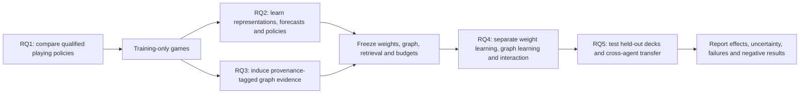

# Agent learning and play-built knowledge: research-question protocol

This protocol defines the **planned scientific study**, not achieved results.
Implementation status and execution eligibility remain authoritative in
[IMPLEMENTATION_PLAN.md §6](../IMPLEMENTATION_PLAN.md#6-benchmark--evaluation-plan).
Commands and operational failure handling live in [EXPERIMENTS.md](EXPERIMENTS.md).
The [agents manuscript](../paper/opposition_agents_mtg.tex) contains the matching
research questions. Lock a version of this protocol before confirmatory runs.

## Central thesis and evidence chain

The project asks whether agents can **improve through experience**, whether
different decision policies offer different strength/cost trade-offs, and
whether **strategic evidence extracted from play helps later agents**.
Running every named module is not sufficient evidence for this thesis.

## Research questions and falsifiable comparisons

| Question | Primary contrast | Evidence that answers it | What does not answer it |
|---|---|---|---|
| **RQ1 — Policy comparison:** how do playing agents compare in effectiveness, reliability and inference cost? | Qualified policy A vs B in the same declared deck/opponent strata | Held-out independent-game effects, completion, latency and actual component activation | An agent name, a successful API call, or pooled wins across different decks |
| **RQ2 — Parametric learning:** does training on native play improve predictions and downstream decisions? | Same learner before vs after training, with the same graph and deployment budget | Held-out predictive diagnostics **and** improved game outcomes, replicated across training seeds | Low training loss, or loading a legacy JEPA checkpoint whose planner uses untrained components |
| **RQ3 — Graph memory:** does strategic evidence mined from play help a frozen policy? | Curated graph vs curated + training-induced evidence, with identical weights | Held-out game improvement and traceable use of relevant evidence; randomized-graph control | More triples, co-occurrence in winning decks, or richer prompts alone |
| **RQ4 — Complementarity:** do graph learning and parametric learning help independently or interact? | Difference-in-differences in a weights × graph factorial | Estimated interaction with game-level uncertainty | Calling a changing four-component stack “fusion” |
| **RQ5 — Transfer and accumulation:** does learned evidence improve later agents on unseen deck families or across producer policies? | Training-derived graph from producer A applied to frozen consumer B on held-out decks | Transfer effect, independent producer-run replication and leakage-free versioned snapshots | Reusing evaluation games as evidence, or improvement only on the exact training decks |

The hypotheses are directional, but negative and null results are valid:
learning may improve predictions without improving play; a graph may harm an
agent; benefits may disappear off-distribution. Do not reinterpret a failed
integration as a scientific null result.

## Study A — Establish the policy comparison (RQ1)

### Two different comparisons

1. **Deployment-stack comparison:** compare complete qualified policies,
   disclosing context, candidate generator, inference service, model size,
   fallback and planning budget. This answers what can be deployed, not which
   isolated design choice caused a difference.
2. **Mechanism comparison:** identical saved perspective-safe observations,
   legal action identities, descriptions, shortlist, option permutations and
   outcome evaluator; change only the selector/objective under test.

| Family | Conditions to qualify | Required control or qualification |
|---|---|---|
| Baseline | Random; native-wire heuristic; translated Python heuristic | Distinguish implementations; exclude concessions consistently |
| Language | Installed general chat models; Tev1 0.8B/4B | Size-matched base/chat comparator for a decision-tuning claim, identical context/options, no uncounted fallback |
| Model-based | Explicit-checkpoint direct policy; recurrent dream search | Verify loaded parameter coverage, reward/dynamics training and native action encoding |
| Control | KL; information-gain proxy; ambiguity proxy | Equal model, candidate set, horizon and scorer budget for objective-only claims |
| Fusion | Explicit LLM + trained model, later + curated graph | Component activation traces, shared candidate set, score normalization and prespecified weights |

The native-AI benchmark is an **anchor opponent**. It is not an agent-vs-agent
tournament. A true policy comparison tournament needs a two-connection native
controller, both policies independently receiving filtered observations,
shared timeout rules, identity-safe actions and seat/start-player balancing.
Qualify this controller before claiming agents beat one another. Commander
requires a separate multi-seat and multiplayer-aware qualification.

Use a small anchor study first, then a balanced head-to-head matrix over
eligible policies. Report matchup tables and strength/cost Pareto frontiers;
do not assume transitive rankings from Elo alone. Keep the anchor unchanged
while training learners so improvement is not an easier-opponent artefact.

### Anchor policy and information regime

The wire-random baseline is uniform over supplied legal indices (including
concession if supplied); the Python `RandomAgent` is instead weighted.
Wire heuristic uses land/cast/activate/attack tiers, not the translated
Python heuristic's counterspell and blocking tactics. Keep these labels
distinct and prespecify a common concession policy for confirmatory comparisons.

Upstream `phase-ai` combines tactical policies, loop/safety gates, a fixed
turn-dependent fitted evaluator and optional beam/rollout search. VeryEasy
retains tactical scoring and temperature-4 stochastic choice despite no tree
search. Medium enables bounded search, not a different version of our heuristic.
It accepts internal game state and its shipped presets disable hidden-zone
resampling. External policies instead receive filtered observations. This
privileged-access asymmetry must be disclosed; a causal policy comparison
requires independently qualified matching of information and compute.

If a Swiss tournament is added, define match points (win 3, draw 1, loss 0)
and Buchholz as the sum of final points of the opponents actually faced,
counting repeated encounters. Higher Buchholz breaks equal-point ties by
opponent schedule strength, not estimated winning probability. Exclude
unplayed rounds from this sum, report byes/forfeits separately and never
turn operational failures into draws. Keep balanced head-to-head tables
and uncertainty primary; no native Swiss results have yet been measured.

## Study B — Show actual learning (RQ2)

Use **native** training trajectories only for the target claim.
Split before extraction/training: whole games, deck construction families,
producer-run batches and graph provenance, not random decision rows.
Learning runs share the same data shards and architecture where possible.

| Arm | What changes | What stays fixed |
|---|---|---|
| `W0` | No task training; initial representation/policy | Initialization distribution, architecture and graph |
| `Wpred` | Representation and transition/reward prediction training | Initial policy, graph and inference budget |
| `Wpolicy` | Policy/value training on the same experience | Frozen representation/dynamics where the design permits |
| `Wjoint` | Qualified full training pipeline | Dataset, architecture, declared optimization budget and graph |

Distinguish fixed-data training (sample efficiency and mechanism) from
adaptive self-play (experience and policy both change). Do not silently give
the joint learner more games or optimization steps.

Use at least five independent training seeds for an initial learning-curve
study; assess whether more are needed from between-run variance.
Evaluate prespecified checkpoints at 0%, 25%, 50% and 100% of the training
budget, plus a validation-selected checkpoint. Final holdout is accessed
once per locked analysis, not used to select checkpoints.

**Diagnostics:** one-step/multi-step held-out embedding error, latent variance
and effective rank, reward/terminal prediction calibration, sensitivity to
actions, native transition alignment, imagined-legality violations and policy
choice quality on audited tactical probes. Latent error is comparable only
under a common frozen evaluation representation; otherwise report per-model
diagnostics and task outcomes without ranking incompatible latent spaces.

**Downstream:** same qualified policy/rollout budget, anchor opponents and
held-out deck strata. Compare learning curves versus native games, optimizer
steps and training wall time. Existing JEPA training is one-step; current dream
search uses separate recurrent dynamics. A JEPA-planning arm requires wiring
and training the predictor-to-reward/planning interface, not relabelling the
existing recurrent search.

## Study C — Build and evaluate graph memory (RQ3)

Freeze curated ontology/card facts as `Kcur`. Generate induced evidence only
from training games, preserving producer, game, deck, source snapshot, support,
refutation, exposure denominator and extraction version. Keep facts immutable.

1. Predeclare conservative candidate relations (e.g. contextual pair synergy,
   threat/answer associations) and extraction/support rules.
2. Record both successes and failures, opportunities where a relation could
   have occurred, and relevant deck/archetype context. Frequent card pairs in
   a strong deck are not automatically causal combos.
3. Store evidence as typed, append-only induced assertions; do not overwrite
   normative relations or automatically promote to curated truth.
4. Freeze a snapshot before evaluation. Every retrieval has a graph version,
   relation identity/provenance, query and observed influence on policy scoring.

### Frozen-policy graph arms

| Arm | Graph/context | Purpose |
|---|---|---|
| `Knone` | Same non-relational card facts; no relational retrieval | Separates relations from merely providing card text |
| `Kcur` | Curated relations only | Tests the curated symbolic prior |
| `Kind` | Curated + training-induced relations | Tests additional learned strategic memory |
| `Kshuffle` | Curated + type/degree/support-distribution-matched shuffled induced edges | Controls graph volume and additional context |
| `Kunrelated` (secondary) | Matched-size irrelevant training evidence | Controls generic prompt-length/content effects |

Weights, retrieval count/token budget, candidate list, inference service and
fallback policy stay fixed. When an arm has fewer useful relations, use an
explicit neutral padding/control policy rather than revealing holdout answers.
Audit whether shuffling accidentally preserves genuine relations.

**Primary effect:** `Kind − Kcur` on held-out games. Supporting measurements:
relation audit precision/refutation, exposure-adjusted support, retrieval hit
rate, relevant-evidence use, graph growth and saturation, inference cost,
support thresholds, and removal of the retrieved relations. These explain
mechanisms but do not substitute for the primary playing outcome.

Blinded human/tactical review or independent rules/proof checks should assess
sampled relations where applicable. Observed associations remain defeasible;
causal card-synergy claims require additional interventions.

## Study D — Minimal factorial, not every possible combination (RQ4)

After B and C qualify, run the **2 × 3 core factorial**:

| | `Knone` | `Kcur` | `Kind` |
|---|---|---|---|
| Frozen initial weights `W0` | `W0/Knone` | `W0/Kcur` | `W0/Kind` |
| Frozen trained weights `W1` | `W1/Knone` | `W1/Kcur` | `W1/Kind` |

`W1` is one prespecified qualified learning condition from B, not whichever
checkpoint wins on the final holdout. Run the `Kshuffle` diagnostic for the
principal `Kind` contrasts. Estimate:

- **Weight-learning effect:** `Y(W1,K) − Y(W0,K)`.
- **Induced-memory effect:** `Y(W,Kind) − Y(W,Kcur)`.
- **Interaction:** `[Y(W1,Kind) − Y(W1,Kcur)] − [Y(W0,Kind) − Y(W0,Kcur)]`.

Here `Y` is the prespecified game-level outcome estimand within balanced
deck/opponent strata. Compute uncertainty jointly over learner/producer runs
and evaluation games, not by treating all decisions as independent.

Then use focused **leave-one-component-out fusion ablations** on one qualified
consumer: remove LLM reranking, relational retrieval, trained forecasts or
planning one at a time. Distinguish an equal-inference-budget study from a
natural deployment-cost study. Retune fusion weights on validation only;
report fixed-weight removal and retuned removal separately.

Decision model + planner + KG is a proposed integration, not an existing arm.
Do not launch a label unless activation probes demonstrate all its components.

## Study E — Cross-agent transfer and graph accumulation (RQ5)

1. Generate equally budgeted training traces from different producer policies.
2. Induce independent graphs using identical extraction rules and **equal
   evidence exposure**, not just equal raw triple counts.
3. Hold consumer weights fixed. Compare its own-policy graph, another
   producer's graph, a mixed-producer graph and `Kcur`.
4. Evaluate on held-out deck families and adversarial tactical interactions.
   Audit card/deck overlap explicitly; same archetype name is not a clean split.

For cumulative memory, freeze `K0,K1,...,Km` after prespecified training batches.
Use matched `Kcur`-only training controls and equal experience budgets.
Evaluate each snapshot on a **validation** monitor; reserve an untouched
final test family for the locked final snapshot. Repeatedly inspecting the
same holdout while choosing evidence thresholds creates leakage.

Separate graph-only accumulation (consumer weights fixed) from joint
weight/graph learning. Graph snapshots generated by one campaign are
correlated: replicate producer campaigns and cluster uncertainty by them.
A pooled mixed graph must not simply contain more experience than its controls.

## Shared design, statistics and stopping rules

- **Data boundaries:** training / validation / final test by entire deck
  families and games; graph evidence inherits the generating split.
  Perspective filtering prevents opponent private information from reaching
  deployed retrieval or prompts. Post-game full-state analysis needs explicit
  justification and cannot leak inaccessible features into the policy.
- **Strata:** archetype, deck roles, opponent and difficulty; seat/start player
  when controllable. The seven current lists have repeated burn variants:
  seven lists are not seven independent strategic archetypes.
- **Eligibility:** at least 20 calibration games per intended condition,
  >=95% completion, zero protocol/illegal-choice failures and audited actions.
  New repairs start a new versioned campaign; retain earlier failure evidence.
- **Unit:** independent completed game/pod for playing outcomes; independent
  learner/graph-producer run for learning claims. Do not inflate sample size
  with turns, decisions or correlated seats within one pod.
- **Primary outcomes:** predeclare one principal playing contrast per study.
  Report win/completed (true draws included in denominator), completion and
  wins/scheduled together. A win-plus-half-draw score is a separately declared
  secondary endpoint, not an interchangeable definition of win rate.
- **Uncertainty:** Wilson intervals for cell win rates; stratified clustered
  bootstrap or prespecified hierarchical analysis for contrasts, training
  variability and interactions. Holm-adjust the confirmatory contrast family.
- **Power:** plan around a smallest worthwhile effect and variance from pilots.
  100 games near 50% yield about +/-10 percentage-point uncertainty.
  Approximately 1,570 independent games **per arm** detect a five-point
  difference near 50% at 80% power/two-sided 5%, before multiplicity/clustering.
  Factorials and training-run variation require simulation-based power.
- **Reproducibility:** freeze engine/binary/data, revision + dirty diff,
  deck payloads, model/checkpoint loaded keys, quantisation, graph snapshots,
  extraction/retrieval rules, hardware, RNG scope, warm-up and limits.
- **No silent degradation:** record loaded/missing parameters, fallback reason,
  invoked component counts and time; random initialization or heuristic-only
  fusion is not the named trained/full-model arm.
- **Stopping:** fixed samples and limits, no favourable-result early stop.
  Stop on operational/semantics gate failures and report feasibility, not
  a biological/scientific null. No unlimited campaign launched from this plan.

## Paper package and order

1. **Now:** publish runtime feasibility, failures and qualified resource
   evidence separately; run bounded model-stack probes.
2. **Implementation gates:** native multi-policy controller; activation and
   fallback audit; native learning; split-safe graph induction/retrieval.
3. **Core paper:** A (policy comparisons), B (learning), C (graph memory).
   Add D only when B/C are real interventions.
4. **Extension:** E (cross-agent accumulation/transfer), then Commander if
   independently qualified. Reduce claims rather than fake completion.

The larger deck-generalisation extension should stratify tempo, midrange,
control, ramp, recursion, artifact synergy, prison and combo demands, with
several independent constructions per family. Hold out construction families,
audit card/package overlap and distinguish unseen-list from unseen-playstyle
transfer. Balance experience across producers and report per-family effects;
keep cross-format and multiplayer shifts as separate studies rather than
confounding deck variety with different game rules.

Expected figures: policy strength/cost frontier; training learning curves;
graph evidence/support curves; held-out `Kcur` versus `Kind` effects;
2 × 3 factorial interaction plot; cross-producer transfer matrix.
Release configs, all attempts, split manifests, graph/checkpoint provenance,
analysis code and regenerated paper tables. Negative results and harmful
graph effects belong in the results, not the exclusion list.
