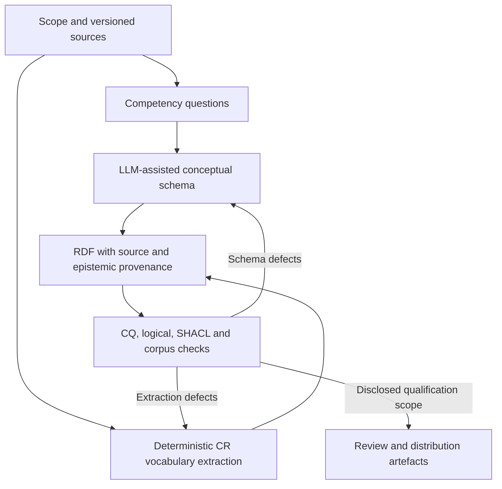

# MTG Ontology Extension Guide

**Status**: Design Document for Systematic Ontology Evolution  
**Tool**: [OntologyExtender](https://github.com/DataScienceLabFHSWF/OntologyExtender) (MIT License, HITL Multi-Agent Framework)  
**Current Ontology**: [mtg-ontology-v2.0.ttl](../data/ontology/mtg-ontology-v2.0.ttl)
**Target**: Comprehensive representation of Magic: The Gathering rules and strategic concepts

---

## Current implementation and KG Workbench import (October 2026)

The sections below retain historical design context; implemented status and
remaining work are tracked in [IMPLEMENTATION_PLAN.md](../IMPLEMENTATION_PLAN.md).

The current separation is **conceptual and data-layer modularity**, not yet a set
of independently importable OWL domain modules:

| Layer | Meaning | Current source |
|---|---|---|
| Rules/vocabulary | Normative rule references, card types, subtypes and keywords | [schema](../data/ontology/mtg-ontology-v2.0.ttl) and separate generated [factual vocabulary](../data/ontology/mtg-cr-types.ttl) |
| Card descriptions | Immutable card designs/printings, abilities and qualities | Schema; Scryfall ABox builder |
| Gameplay | Objects, zones, players, events and situation-relative roles | Schema; game execution belongs to phase-rs, not OWL |
| Strategy | Combos, pieces, outcomes, answers, archetypes and curated synergies | Schema and optional graph import/query code |
| Decisions | Agent beliefs, policies, objectives and decisions | Distinct `mtgd:` namespace in the schema |
| Learned evidence | Reified induced synergies, support/refutation counts and run provenance | Separate schema layer; not automatically promoted to curated facts |

The workbench exporter groups these into six editor modules plus an external
dependency module. These groupings are a review view, **not an OWL import
dependency graph**, and do not prove that card/strategy instances have been
written to Neo4j or used by agents.

### How the ontology was constructed

The process is **author-directed and LLM-assisted**, with two construction
tracks and a validation feedback loop. It is not an autonomous LLM extraction
of the Comprehensive Rules, and it does not establish that OntologyExtender
or MASEO was executed. The historical design proposals later in this guide
must not be read as execution records.

| Step | What happened | LLM role | Authoritative output |
|---|---|---|---|
| 1. Scope and requirements | Define card/rules/gameplay/strategy/decision/evidence boundaries; formulate versioned questions | Assistance with formulation and design discussion | [32 competency questions](../data/competency_questions.yaml), not an independent gold benchmark |
| 2. Conceptual modelling | Revise the earlier schema using DUL identity, role/situation and quality/region patterns; express relations and OWL constraints | Drafting and revising schema/tooling proposals in an interactive coding workflow | [Curated schema](../data/ontology/mtg-ontology-v2.0.ttl), with named-term epistemic annotations and selected rationale/CQ links |
| 3. Normative vocabulary | Parse a fixed CR revision by rule number and anchor; emit typed terms, identifiers and source links | No LLM call during extraction; coding assistance is distinct from runtime inference | [Generator](../scripts/build_ontology_from_cr.py) and [factual vocabulary](../data/ontology/mtg-cr-types.ttl); rule-text tree remains local |
| 4. Validation | Check syntax, CQ queries, SHACL, OWLAPI/HermiT and declared Scryfall type-line corpora | Assistance with checker development and interpreting diagnostics; outputs come from tools | Explicit reports with input hashes and enabled/skipped/failing scopes |
| 5. Revision | Correct missing concepts, namespace collisions and illegal property characteristics; add regressions | Assisted, defect-driven source/code revisions | Maintained schema/parser/tests; checks are rerun rather than accepting a plausible proposal |
| 6. Packaging | Preserve authoritative RDF and provenance; create editor projections and queryable snapshots | Tooling assistance, not a new source of domain facts | Turtle/import lock, workbench JSON, lossless RDF/JSON and read-only Fuseki snapshot |



**Concrete example: Vehicle.** Modelling places Vehicle under artifact
subtypes, not among the fifteen card types. Deterministic extraction reads the
enumeration at CR 205.3g and emits a source-grounded term. The schema expresses
the artifact-subtype implication, while the parser checks explicit card type
lines. The CR supplies the fact; the LLM does not invent the authoritative list.

Here, **curated does not mean independently expert-verified**. It distinguishes
maintained assertions from induced gameplay evidence. Independent modelling
review is still pending. Existing uses of "hand-authored schema" mean the
non-rule-generated schema track, not proof of exclusively unaided authorship.

Artifact regeneration is supported by versioned source/code and hashes, but
there is no complete frozen prompt/model/acceptance history for historical
construction. Do not invent model names, prompt counts or approval logs.
Future assisted revisions should archive model ID, prompt/context, proposed
diff, motivating CQ/source, validation results and acceptance rationale.
The [ontology paper](../paper/mtg_ontology.tex) now distinguishes this
retrospective account from that prospective provenance requirement.

In [KG Workbench](https://github.com/DataScienceLabFHSWF/kg-workbench), choose
the ontology JSON import action and upload
[mtg-workbench.json](../data/ontology/mtg-workbench.json). It includes classes,
named parent links, typed relations, datatype attributes, all 32 competency
questions (with original YAML in notes), and factual vocabulary examples.
It does not contain full Comprehensive Rules text or the whole Scryfall corpus.
Module references and all class/relation references are self-contained.

The export targets the workbench's import contract at revision
`4d61c37f4e52c22c344aab004ada7622bec9fead`, validated using its actual Zod
schema. Regenerate all three files with:

```powershell
.\.venv\Scripts\python.exe scripts\export_ontology_workbench.py
```

- [mtg-workbench.json](../data/ontology/mtg-workbench.json): import this into the editor.
- [mtg-workbench.report.json](../data/ontology/mtg-workbench.report.json):
  source SHA-256 hashes, target revision, counts and projection warnings.
- [mtg-workbench.rdf.json](../data/ontology/mtg-workbench.rdf.json):
  lossless RDF/JSON of the asserted local schema + factual vocabulary, including
  anonymous restrictions, literal datatypes/languages and property-chain lists.
  This companion is **not** a workbench ontology-import file; it does not fetch
  or resolve external OWL imports.

Workbench cannot preserve arbitrary OWL axioms. Union domains/ranges expand into
display pairs; inverse endpoints can be recovered, but otherwise unspecified
endpoints display as `owl:Thing` with warnings. Only one named parent is supported.
Keys, restrictions, disjointness, chains and the full RDF remain authoritative
in Turtle/the RDF companion. Do not round-trip editor JSON over the authoritative
Turtle or mistake vocabulary examples for a populated combo knowledge base.

### Runtime setup safety

[N10sSetup](../src/knowledge/n10s_setup.py) now defaults to the v2.0 Turtle
schema, imports the separate factual vocabulary, verifies connectivity before
setup, preserves compatible graph configuration and refuses incompatible config
instead of dropping it. RDF imports require explicit `OK` status and positive
parsed/loaded counts; full setup returns these reports. Legacy `Card` indexes
remain for compatibility, alongside v2.0 `CardDesign`/`CardPrinting` indexes.
The training KG stage stops on setup failure rather than silently skipping it.

The mounted [bootstrap Cypher](../neo4j/init/01_init_n10s.cypher) is a **manual,
fresh-database-only** example; stock Neo4j does not run that directory automatically.
Neither mocked setup tests nor successful file exports constitute live import
qualification. Read-only readiness/manifests, remaining query-label reconciliation,
bulk-write accounting, bounded runtime prefetch and strict benchmark fallback
policy remain K10; this setup does not qualify a live Neo4j import.

### Pinned reasoning and read-only RDF service

Install the declared ontology extra and, on Windows x64, the checksum-pinned
local JDK/Fuseki distributions; these do not change system PATH or JAVA_HOME:

```powershell
.\.venv\Scripts\python.exe -m pip install -e ".[ontology]"
powershell -NoProfile -File scripts\install_ontology_tools.ps1
.\.venv\Scripts\python.exe scripts\fetch_ontology_imports.py
.\.venv\Scripts\python.exe scripts\validate_ontology.py --reasoner-report .tools\ontology-schema-report.json
```

The import lock fixes DUL, PROV-O, SKOS and OWL-Time bytes. Downloads verify
hashes; `--update-lock` is an explicit revision operation, not the default.
The checker materialises the closure as RDF/XML, freezes its Java source and
runs actual OWLAPI/HermiT, with no Java-side network imports. `owlready2` supplies
the bundled HermiT jar, rather than loading Turtle through a Windows file URI.
`--java` can select a JDK explicitly. Reports record source/checker/jar hashes.

The tested schema plus pinned dependencies is consistent, with no unsatisfiable
named classes. The raw dependency closure nevertheless has 37 OWLAPI profile
violations, including PROV annotation/object-property punning and SKOS RDF-list
references. External documents are not rewritten to hide these diagnostics.
`--require-dl-profile` fails on those violations and cannot be combined with
`--no-imports` or `--skip-reasoner`. Focused local-schema object/event ABox probes
pass for a valid individual and reject a disjoint double classification.
The larger run using `--reasoner-vocabulary data\ontology\mtg-cr-types.ttl`
exceeded 600 seconds: its consistency is **not qualified**. Full corpus reasoning,
independent alignment review and profiling that larger input remain release gates.

Run the opt-in RDF endpoint in the foreground:

```powershell
.\.venv\Scripts\python.exe scripts\serve_ontology.py --port 3030
```

[serve_ontology.py](../scripts/serve_ontology.py) binds localhost only and loads
a frozen TriG snapshot into a memory dataset. It exposes `/mtg/query` and the
read-only `/mtg/data` Graph Store endpoint, not an update endpoint. Six named
graphs preserve the schema, vocabulary and four imported sources; the default
graph is the asserted local schema/vocabulary union, not inferred triples.
The run directory contains the snapshot, config and hash/count manifest.
`--build-only` prepares these files without starting a server. This is a
reproducible read-only review service, **not a persistent TDB deployment**.

A real isolated Fuseki smoke verified 6,222 default triples, all six source
graph counts, 14/14 CQ queries and HTTP 405 on an update attempt. The temporary
test service is stopped after validation; no automatic service or agent query
integration is enabled. Fuseki provides canonical RDF/SPARQL access, HermiT
logical analysis, and Neo4j optional strategic projections. Benchmark agents
still need qualified writes and bounded, versioned prefetch rather than
unbounded SPARQL requests in the decision hot path.

---

## Table of Contents

1. [Architecture Overview](#architecture-overview)
2. [Current Ontology Structure](#current-ontology-structure)
3. [OntologyExtender Integration](#OntologyExtender-integration)
4. [Implementation Phases](#implementation-phases)
5. [Comprehensive Rules Ingestion](#comprehensive-rules-ingestion)
6. [SHACL Validation](#shacl-validation)
7. [Knowledge Base Integration](#knowledge-base-integration)
8. [Maintenance & Evolution](#maintenance--evolution)

---

## Architecture Overview

### Design Rationale

Magic: The Gathering contains:
- **~30,000 unique card designs** (Scryfall API)
- **~500+ keyword abilities** (Comprehensive Rules Section 702)
- **~200+ ability interactions** (e.g., Layer system, CR 611)
- **12 phases per turn** with complex trigger windows
- **7 spell/ability resolution layers** (CR 611.1-611.7)
- **Infinite combo spaces** (Commander Spellbook: ~10K known combos)

A manual ontology cannot capture this breadth. **OntologyExtender** enables:
- **Automated candidate generation** via LLM agents (GPT-4)
- **Human-in-the-loop validation** (you approve/reject each addition)
- **Semantic consistency enforcement** via SHACL constraints
- **Change tracking & versioning** (git + RDF diffs)
- **Modular reasoning** (compose lower ontologies for sub-domains)

### 4-Layer OWL Architecture

```
┌─────────────────────────────────────────────────────────────┐
│ Layer 4: STRATEGIC KNOWLEDGE (Combos, Archetypes, Synergies)│
├─────────────────────────────────────────────────────────────┤
│ Layer 3: GAME MECHANICS (Keywords, Abilities, Effects)      │
├─────────────────────────────────────────────────────────────┤
│ Layer 2: GAME STRUCTURE (Zones, Phases, Players, Cards)     │
├─────────────────────────────────────────────────────────────┤
│ Layer 1: CORE CONCEPTS (Color, Type, Mana, Stack)           │
└─────────────────────────────────────────────────────────────┘
         imports            imports          imports
         ↓                   ↓                ↓
    mtg-base.owl      mtg-structure.owl  mtg-mechanics.owl
         imports ←─────────────────────────────┘
         ↓
      mtg-ontology-v1.1.owl (Unified)
         ↓ (n10s import)
       Neo4j Knowledge Graph
```

---

## Current Ontology Structure

### Layer 1: Core Concepts (~100 lines)
**Covered**: Color, Mana, CardType, Zone, Phase  
**Gap**: Mana ability rules (CR 602.2, convoke, hybrid mana, etc.)

### Layer 2: Game Structure (~200 lines)
**Covered**: Game, Player, Turn, Phase, Zone instances  
**Gap**: Stack rules (CR 601.2-601.3), linked list structure for order

### Layer 3: Ability System (~300 lines)
**Covered**: Activated, Triggered, Static, Special abilities; 25 keywords  
**Gap**: 475 remaining keywords, ability interactions, stacking rules

### Layer 4: Strategic Knowledge (~400 lines)
**Covered**: Combo, Synergy, Archetype, WinCondition  
**Gap**: Card interactions, combo chains, synergy networks

**Total**: ~1000 lines RDF/XML. **Target**: ~5000 lines (5x expansion).

---

## OntologyExtender Integration

### What is OntologyExtender?

[OntologyExtender](https://github.com/DataScienceLabFHSWF/OntologyExtender) is an MIT-licensed framework for **multi-agent ontology evolution**:

**Core Workflow:**
```
1. Extract candidates from source (CR text, card descriptions)
   ↓
2. Generate proposal via LLM agent (e.g., "Add Flying keyword with definition")
   ↓
3. Validate with SHACL constraints + consistency checks
   ↓
4. Human review & approval (you say "yes" or request edits)
   ↓
5. Merge into base ontology + commit to git
   ↓
6. Re-import to Neo4j via n10s
   ↓
7. (Repeat) → Iterative evolution
```

### Why OntologyExtender for MTG?

| Challenge | Solution |
|-----------|----------|
| **Manual curation won't scale** (500+ keywords) | Agents propose candidates automatically |
| **Semantic consistency hard to maintain** | SHACL constraints enforce consistency |
| **Domain knowledge in CR text, not structured** | Extract + parse CR; agents learn patterns |
| **Feedback loop needed** | Human review gates each addition |
| **Version control needed** | Git tracks all changes, with PROV traces |
| **Impact analysis hard** | Agents check downstream consequences |

---

## Implementation Phases

### Phase 1: Ontology Validation & Setup (Weeks 1-2)

**Goal**: Ensure current ontology is syntactically & semantically correct.

#### 1.1 SHACL Shape Validation

Create `data/ontology/mtg-shapes.ttl`:

```turtle
@prefix mtg: <http://purl.org/mtg/ontology#> .
@prefix sh: <http://www.w3.org/ns/shacl#> .
@prefix rdfs: <http://www.w3.org/2000/01/rdf-schema#> .

# Keyword must have rdfs:label and mtg:keywordType
mtg:KeywordShape
  a sh:NodeShape ;
  sh:targetClass mtg:Keyword ;
  sh:property [
    sh:path rdfs:label ;
    sh:minCount 1 ;
    sh:maxCount 1 ;
    sh:datatype xsd:string ;
  ] ;
  sh:property [
    sh:path mtg:keywordType ;
    sh:minCount 1 ;
    sh:maxCount 1 ;
    sh:in (
      "evasion" "protection" "combat" "removal" "draw" "acceleration" "timing"
    ) ;
  ] .

# Card must have cardName, manaCost, and at least one cardType
mtg:CardShape
  a sh:NodeShape ;
  sh:targetClass mtg:Card ;
  sh:property [
    sh:path mtg:cardName ;
    sh:minCount 1 ;
    sh:maxCount 1 ;
  ] ;
  sh:property [
    sh:path mtg:hasCardType ;
    sh:minCount 1 ;
  ] .

# Combo must have 2+ pieces
mtg:ComboShape
  a sh:NodeShape ;
  sh:targetClass mtg:Combo ;
  sh:property [
    sh:path mtg:hasPiece ;
    sh:minCount 2 ;
  ] .
```

#### 1.2 Import & Validate in Neo4j

```bash
# Load ontology into Neo4j (requires n10s plugin)
docker exec opposition-neo4j cypher-shell -u neo4j -p ${NEO4J_PASSWORD} \
  "CALL n10s.onto.import.fetch('file:///data/ontology/mtg-ontology-v1.1.owl', 'RDF/XML')"

# Validate with APOC
CALL apoc.load.rdf('file:///data/ontology/mtg-shapes.ttl', 'Turtle') YIELD rel
RETURN COUNT(rel) AS triplesLoaded;
```

#### 1.3 Export Initial State

```bash
# Export for change tracking (git diff will show additions)
docker exec opposition-neo4j cypher-shell -u neo4j -p ${NEO4J_PASSWORD} \
  "CALL n10s.onto.export.rdf(null, 'RDF/XML') AS rdf RETURN rdf" > initial-state.owl
git add initial-state.owl && git commit -m "Ontology baseline: v1.1 (1000 lines, 7 layers)"
```

### Phase 2: Comprehensive Rules Extraction (Weeks 3-4)

**Goal**: Extract structured knowledge from Comprehensive Rules document.

#### 2.1 Obtain Comprehensive Rules Text

```bash
# Download latest CR from Wizards of the Coast
curl -o "data/rules/ComprehensiveRules.txt" \
  "https://media.wizards.com/2024/downloads/magic-comprehensive-rules.txt"

# File structure:
# - Section 1: Game Concepts (layers, players, zones, etc.)
# - Section 2: Parts of a Card
# - Section 3: Game Rules (phases, steps, etc.)
# - Section 6: Spells, Abilities, Costs (most important for ontology)
# - Section 7: Additional Rules (special situations)
```

#### 2.2 Parse & Extract Triplets

Use **OpenIE + spaCy + GPT-4 prompt engineering** to convert CR text to RDF triplets:

```python
# tools/extract_rules.py
import spacy
from transformers import pipeline
import openai

nlp = spacy.load("en_core_web_lg")
openie = pipeline("openie", model="extract-tasty/openie-small")

def extract_from_cr_section(text: str, section: str) -> list[tuple[str, str, str]]:
    """
    Extract (subject, predicate, object) triplets from CR section.
    
    Example:
    Input:  "602.2a. Activated abilities have a cost and an effect..."
    Output: [
      ("ActivatedAbility", "hasCost", "Cost"),
      ("ActivatedAbility", "hasEffect", "Effect"),
      ...
    ]
    """
    doc = nlp(text)
    triplets = []
    
    # Use OpenIE for initial extraction
    for sentence in doc.sents:
        for extraction in openie(sentence.text):
            subject = extraction["subject"]
            predicate = extraction["predicate"]
            obj = extraction["object"]
            triplets.append((subject, predicate, obj))
    
    # Use GPT-4 for semantic refinement (expensive, selective)
    # Only on high-confidence/complex rules
    
    return triplets

# Process all CR sections
with open("data/rules/ComprehensiveRules.txt") as f:
    content = f.read()
    sections = content.split("\n\n")
    all_triplets = []
    
    for section in sections[:100]:  # Start with first 100 for testing
        triplets = extract_from_cr_section(section, section.split(":")[0])
        all_triplets.extend(triplets)

# Export as RDF/Turtle
export_to_rdf("data/ontology/mtg-cr-extracted.ttl", all_triplets)
```

**Output**: `mtg-cr-extracted.ttl` (~500-1000 triplets from CR sections 1, 2, 6)

#### 2.3 Candidate Filtering

Filter extracted triplets to identify **extension candidates**:

```python
# tools/filter_extension_candidates.py

existing_concepts = load_current_ontology()  # Load mtg-ontology-v1.1.owl

candidates = []
for triplet in all_triplets:
    subject, predicate, obj = triplet
    
    # Skip if already in ontology
    if (subject, predicate, obj) in existing_concepts:
        continue
    
    # Score candidate by relevance
    score = score_candidate(subject, predicate, obj)
    
    if score > THRESHOLD:
        candidates.append({
            "triplet": triplet,
            "source_section": find_source_section(triplet),
            "confidence": score,
            "reason": why_relevant(triplet)
        })

# Save top 50-100 for agent proposal
save_candidates("data/ontology/candidates.json", candidates[:100])
```

### Phase 3: OntologyExtender Agent Loop (Weeks 5-6)

**Goal**: Use OntologyExtender to propose + validate new concepts interactively.

#### 3.1 Setup OntologyExtender

```bash
# Install OntologyExtender (MIT license)
pip install OntologyExtender

# Create project structure
mkdir -p .oe_workspace
cat > .oe_workspace/config.json << 'EOF'
{
  "base_ontology": "data/ontology/mtg-ontology-v1.1.owl",
  "candidate_file": "data/ontology/candidates.json",
  "shapes_file": "data/ontology/mtg-shapes.ttl",
  "output_dir": "data/ontology/extensions",
  "llm_model": "gpt-4",
  "max_candidates_per_session": 10,
  "validation_mode": "strict"
}
EOF
```

#### 3.2 Interactive Proposal Loop

For each candidate from phase 2:

```
AGENT 1 (Proposer): "I suggest adding mtg:EvasionKeyword as a subclass of mtg:Keyword
  because Section 702.3 (Evasion Abilities) lists Flying, Shadow, Horsemanship which all
  share the property of preventing standard blocking."

VALIDATION: Check against SHACL shapes
  ✓ Has rdfs:label
  ✓ Has mtg:keywordType
  ✓ Subclass relationship valid
  ✓ No conflicts with existing classes

AGENT 2 (Reviewer): "Looks good; I'd suggest also:
  - Add mtg:defineBlockingRestriction property
  - Link to CR Section 702"

YOU (Human review): "Approve? Y/N"
  → Y: Merge into ontology, commit to git
  → N: Propose revision or discard

REDO: Next candidate
```

#### 3.3 Expected Additions (Phase 3 Output)

**Keywords** (100-150 lines):
- Evasion: Fly, Shadow, Horsemanship, Phase, etc.
- Combat: Vigilance, Menace, Reach, First Strike, Double Strike
- Removal: Deathtouch, Lifelink, Trample
- Protection: Shroud, Hexproof, Protection, Indestructible
- Timing: Flash, Split Second, Suspend
- Mana: Haste, Fast, Ramping

**Abilities** (150-200 lines):
- Passive (static) abilities: Any/All effects
- Activated abilities: Cost-effect pairs
- Triggered abilities: Event-condition-response
- Special actions: Lands, Planeswalkers, Battles

**Rules Concepts** (100-150 lines):
- Stack & Resolution (CR 601.2-601.3)
- Layers & Continuous Effects (CR 611.1-611.7)
- Replacement Effects (CR 614.1-614.9)
- Zones & Zone Changes (CR 400.1-400.11)

### Phase 4: Combo & Synergy Ingestion (Weeks 7-8)

**Goal**: Add strategic knowledge from Commander Spellbook + card interactions.

#### 4.1 Import Commander Spellbook

```python
# tools/import_combos.py

import requests
import json

# Download Commander Spellbook data (~10K combos)
response = requests.get("https://commanderspellbook.com/api/v1/combos/")
combos = response.json()

# Convert to RDF
for combo in combos[:100]:  # Start with 100 for testing
    pieces = combo["includes"]  # List of cards
    result = combo["result"]
    
    # Create mtg:Combo instance
    combo_uri = f"http://purl.org/mtg/ontology#Combo_{combo['id']}"
    
    # Add triplets
    # combo a mtg:Combo .
    # combo mtg:hasPiece card1, card2, card3 .
    # combo mtg:result "infinite mana" or "win" .
    
    export_combo_rdf(combo_uri, pieces, result)
```

#### 4.2 Synergy Detection via Neo4j

```cypher
// Find synergies: pairs of cards that appear together in high-performance decks
MATCH (c1:Card)-[:PLAYS_IN]->(d1:Deck),
      (c2:Card)-[:PLAYS_IN]->(d2:Deck)
WHERE c1.name < c2.name  // Avoid duplicates
  AND id(d1) = id(d2)    // Same deck
  AND d1.winrate > 0.55   // Successful deck
RETURN c1.name, c2.name, COUNT(DISTINCT d1) as co_appearances
ORDER BY co_appearances DESC
LIMIT 500
```

**Output**: `mtg-combos.owl`, `mtg-synergies.owl`

### Phase 5: Continuous Iteration (Weeks 9+)

**Goal**: Establish feedback loop for ongoing ontology improvement.

#### 5.1 Agent-Driven Discovery

Run background agents to find:
1. **Missing keywords** (parse new card releases)
2. **Interaction gaps** (agents suggest combos not yet in ontology)
3. **Rule clarifications** (ambiguities in CR → SHACL constraints)

#### 5.2 Feedback from Game Simulation

Each time agents play a game:
- Record actions taken
- Identify concepts used
- Flag missing ontology coverage

```python
# src/orchestrator/ontology_feedback.py

class OntologyFeedbackLoop:
    """Track ontology gaps discovered during game simulation."""
    
    async def log_action_and_check_coverage(self, action: Action) -> None:
        """
        When agent takes action, check if action type is in ontology.
        If not, flag for extension.
        """
        action_concepts = extract_concepts_from_action(action)
        
        for concept in action_concepts:
            if not await self.kg.has_concept(concept):
                self.missing_concepts.append({
                    "concept": concept,
                    "context": action,
                    "timestamp": now(),
                })
        
        # Every 100 games, propose batch extension
        if len(self.missing_concepts) > 10:
            await self.propose_extension_batch()
```

---

## Comprehensive Rules Ingestion

### Data Sources

| Source | Format | Size | Completeness |
|--------|--------|------|--------------|
| **CR** (Wizards Official) | TXT | ~300 KB | 100% rules |
| **Scryfall API** | JSON | ~30K cards | 95% (older cards) |
| **Commander Spellbook** | JSON API | ~10K combos | 80% (popular only) |
| **Gatherer** | HTML | Same as Scryfall | Redundant |

### Parsing Strategy

```
Raw CR Text (300 KB)
  ↓ (spaCy NLP)
Sentences + Parse Trees
  ↓ (OpenIE extraction)
RDF Triplets (~2000)
  ↓ (GPT-4 refinement)
Semantically Normalized Triplets (~1500)
  ↓ (OntologyExtender + SHACL validation)
Approved Class/Property Definitions
  ↓ (Merge into mtg-ontology-vX.Y.owl)
Updated OWL
  ↓ (n10s import)
Neo4j Knowledge Graph
```

### Example: Extract "Flying" Keyword

**CR Source (702.3a):**
> "Flying is an evasion ability. A creature with flying can't be blocked except by creatures with flying and/or reach."

**Parse:**
1. Extract concept: "Flying" (keyword able)
2. Extract definition: "evasion ability"
3. Extract constraint: "can't be blocked except by creatures with flying and/or reach"

**Generate RDF:**
```turtle
mtg:Flying
  a mtg:Keyword ;
  rdfs:label "Flying"@en ;
  rdfs:comment "A creature with flying can't be blocked except by creatures with flying and/or reach" ;
  mtg:keywordType "evasion" ;
  mtg:blockedOnlyBy mtg:Flying, mtg:Reach ;
  owl:sameAs <https://gatherer.wizards.com/Pages/Search/Default.aspx?action=advanced&text=flying> ;
  dc:source "CR Section 702.3a" .
```

---

## SHACL Validation

### Constraint Enforcement

Use SHACL (Shapes Constraint Language) to ensure ontology consistency:

```turtle
# Keyword constraint: must define blocking rules if evasion type
mtg:EvasionKeywordShape
  a sh:NodeShape ;
  sh:targetClass mtg:Keyword ;
  sh:property [
    sh:path [ sh:inversePath mtg:keywordType ] ;
    sh:hasValue "evasion" ;
    sh:minCount 1 ;
    sh:severity sh:Warning ;
  ] ;
  sh:property [
    sh:path mtg:blockedOnlyBy ;
    sh:minCount 1 ;
    sh:message "Evasion keyword must define what can block it" ;
  ] .

# Card constraint: power/toughness only on creatures
mtg:CreatureCardShape
  a sh:NodeShape ;
  sh:targetClass mtg:Card ;
  sh:property [
    sh:path [ sh:inversePath mtg:hasCardType ] ;
    sh:hasValue mtg:Creature ;
    sh:minCount 1 ; # Must be creature to have p/t
    sh:property [
      sh:path mtg:power ;
      sh:minCount 1 ;
    ] ;
  ] .

# Spell constraint: spells are in stack or on the stack only
mtg:SpellStackConstraint
  a sh:NodeShape ;
  sh:targetClass mtg:Spell ;
  sh:property [
    sh:path mtg:inZone ;
    sh:in ( mtg:Stack mtg:Battlefield ) ;
    sh:minCount 1 ;
    sh:message "Spell must be on the stack or on battlefield" ;
  ] .
```

### Validation Commands

```bash
# Validate ontology against shapes
docker exec opposition-neo4j cypher-shell \
  "CALL n10s.validation.validateShapes('file:///data/ontology/mtg-shapes.ttl') YIELD result RETURN result"

# Get violation report
docker exec opposition-neo4j cypher-shell \
  "MATCH (v:ValidationViolation) RETURN v.severity, v.message, COUNT(*) as count"
```

---

## Knowledge Base Integration

### Importing Extended Ontology to Neo4j

```cypher
// 1. Clear old ontology (careful!)
MATCH (n) WHERE n:Ontology DETACH DELETE n;

// 2. Import new ontology version
CALL n10s.onto.import.fetch('file:///data/ontology/mtg-ontology-v1.2.owl', 'RDF/XML', {handleVocabUris: 'MAP'})
YIELD triplesLoaded RETURN triplesLoaded;

// 3. Create indices for fast querying
CREATE INDEX ON :Resource(uri);
CREATE INDEX ON :Keyword(label);
CREATE INDEX ON :Card(name);
CREATE INDEX ON :Combo(id);

// 4. Run validation
CALL apoc.load.rdf('file:///data/ontology/mtg-shapes.ttl', 'Turtle')
YIELD triplesLoaded RETURN triplesLoaded;
```

### Query Patterns

**Find all evasion keywords:**
```cypher
MATCH (k:Keyword {keywordType: 'evasion'})
RETURN k.label, k.rdfs_comment
```

**Find combos by result type:**
```cypher
MATCH (c:Combo)-[:mtg_result]->(r)
WHERE r CONTAINS 'mana'
RETURN c, COLLECT(r) as results
```

**Find synergies between cards:**
```cypher
MATCH (card1:Card)-[:SYNERGY]->(card2:Card)
RETURN card1.name, card2.name, 
  [(card1)-[:SUPPORTS]->(k:Keyword) | k.label] as shared_keywords
```

---

## Maintenance & Evolution

### Versioning Strategy

Follow **Semantic Versioning** for ontology:
- **MAJOR** (v2.0): Breaking changes (class renames, removed properties)
- **MINOR** (v1.2): Non-breaking additions (new subclasses, properties)
- **PATCH** (v1.1.1): Corrections (typos, constraint clarifications)

### Change Tracking

```bash
# All changes committed to git with rationale
git log --oneline data/ontology/
# Example:
# a1b2c3d - Add 25 evasion keywords from CR 702.3 (OntologyExtender Phase 3)
# d4e5f6g - Add mtg:Layer property for continuous effect ordering
# h7i8j9k - Correct mtg:Combo constraint: minCount 2 pieces

# Review diffs
git diff v1.0..v1.1 data/ontology/mtg-ontology.owl | head -100
```

### Maintenance Cycle

**Quarterly Review:**
1. Extract new cards from Scryfall (released in last 3 months)
2. Identify new keywords
3. Run OntologyExtender to propose additions
4. Validate with SHACL
5. Merge approved changes
6. Re-import to Neo4j
7. Tag release (v1.2, v1.3, etc.)

**Game Simulation Feedback:**
After running 1000 agent games:
1. Analyze logs for ontology gaps
2. Propose batch extension (#10 OntologyExtender Phase 5)
3. Iterate as Phases 3-4

---

## Example: Extending for "Haste" Keyword

### Phase 3 Workflow

**Agent Proposal:**
```
Subject: mtg:Haste Keyword
Source: CR 702.9a ("Haste is a static ability...")
Proposal:
  - Class: mtg:Haste (a mtg:Keyword)
  - Type: "timing"
  - Definition: "A creature with haste can attack the turn it enters the
    battlefield."
  - Constraint: Only applies to creatures
  - Related: mtg:Vigilance (costs mana, Haste doesn't)
```

**SHACL Validation:**
```turtle
mtg:HasteShape
  a sh:NodeShape ;
  sh:targetNode mtg:Haste ;
  sh:property [
    sh:path rdf:type ;
    sh:hasValue mtg:Keyword ;
  ] ;
  sh:property [
    sh:path mtg:keywordType ;
    sh:hasValue "timing" ;
  ] ;
  sh:property [
    sh:path rdfs:label ;
    sh:hasValue "Haste"@en ;
  ] .
```

**Approval:**
```
Human: "Approved. Add relationship: mtg:Haste mtg:appearsOnCreatures true"
Agent: "Merged. Updating mtg-ontology-v1.2.owl..."
Commit: "Add Haste keyword - CR 702.9a (OExt Phase 3, iteration 8)"
```

---

## Tools & Environment

### Required

- **n10s** (Neo4j RDF plugin): Already installed
- **APOC** (Neo4j algorithms): Already installed or can add
- **OntologyExtender**: `pip install OntologyExtender`
- **spaCy**: `python -m spacy download en_core_web_lg`
- **OpenIE**: Via transformer models
- **Python 3.10+**

### Optional

- **Protégé** (visual ontology editor): Download from Stanford
- **TopQuadrant TopBraid** (Enterprise validation): For large-scale projects
- **AllegroGraph** (Alternative triple store): If Neo4j hits scaling limits

### Installation

```bash
# Create virtual environment (already done)
source .venv/bin/activate

# Install dependencies
pip install -r requirements-ontology.txt

# Download models
python -m spacy download en_core_web_lg
python -c "import nltk; nltk.download('all')"

# Install OntologyExtender (MIT license)
git clone https://github.com/DataScienceLabFHSWF/OntologyExtender.git
cd OntologyExtender
pip install -e .
```

### requirements-ontology.txt

```
rdflib==6.2.0
owlrl==6.0.0
pyshacl==0.23.0
OntologyExtender>=0.5.0
spacy>=3.7.0
en-core-web-lg @ https://github.com/explosion/spacy-models/releases/download/en_core_web_lg-3.7.0/en_core_web_lg-3.7.0-py3-none-any.whl
transformers>=4.35.0
openie>=5.0.0
openai>=1.2.0
```

---

## Next Steps

### Immediate (This Session)

1. ✅ Create extended ontology v1.1 with 7 layers (1000 lines)
2. ✅ Update opponent_model.py with decklist-aware belief tracking
3. ⏳ **Set up SHACL validation** (Phase 1)

### Short-term (Next 2 Weeks)

4. **Download Comprehensive Rules** text
5. **Extract triplets** from CR (Phase 2)
6. **Setup OntologyExtender** (Phase 3 prep)
7. **Create first batch of keywords** (Flying, Haste, etc.)

### Medium-term (Weeks 3-8)

8. **Run full OntologyExtender cycle** (Phases 3-4)
9. **Import combos** from Commander Spellbook
10. **Integrate ontology feedback** from game simulation

### Long-term (Ongoing)

11. **Quarterly ontology reviews** with new card releases
12. **Agent-driven discovery** (Phase 5)
13. **Performance optimization** (caching, indices, vector embeddings)

---

## References

- [OntologyExtender GitHub](https://github.com/DataScienceLabFHSWF/OntologyExtender)
- [W3C OWL 2 Guide](https://www.w3.org/TR/owl2-primer/)
- [SHACL Specification](https://www.w3.org/TR/shacl/)
- [Magic Comprehensive Rules](https://media.wizards.com/2024/downloads/magic-comprehensive-rules.txt)
- [Scryfall API](https://scryfall.com/docs/api)
- [Commander Spellbook API](https://commanderspellbook.com/api/)

---

**Document Status**: Design Phase → Ready for Implementation  
**Author**: System Design  
**Last Updated**: [Current Date]  
**Next Review**: After Phase 2 (Comprehensive Rules Extraction)
