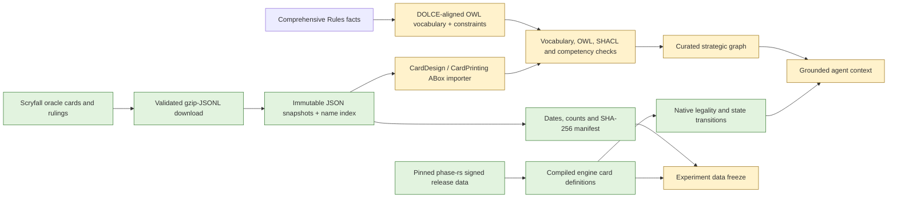
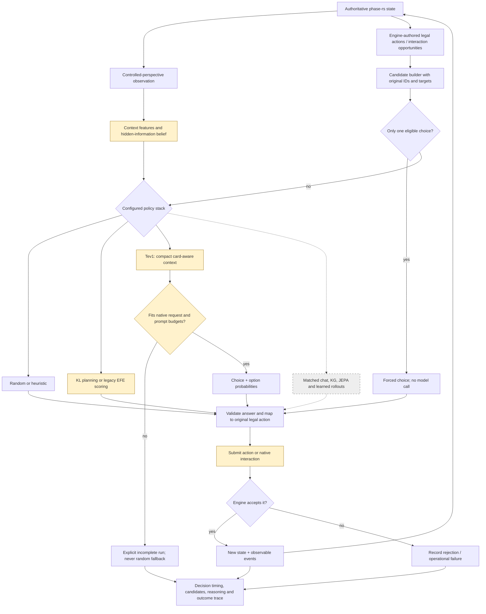
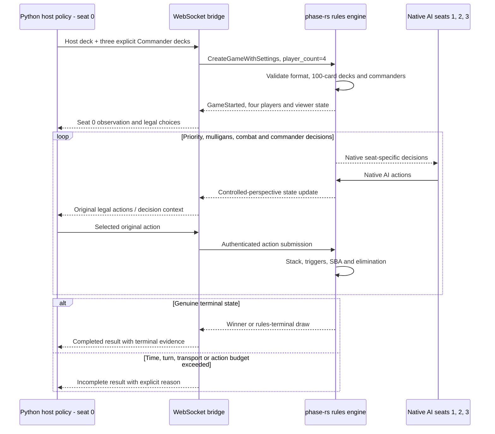
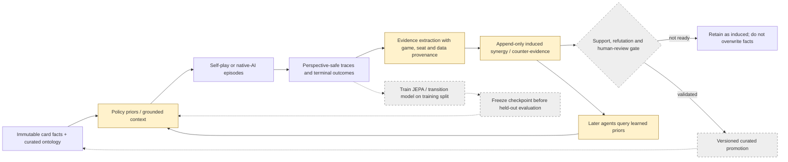
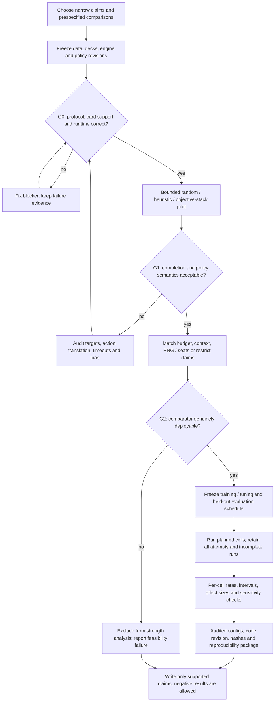

# Research pipelines and decision boundaries

These diagrams describe the intended whole system, not a claim that every
research component is already connected to native gameplay. The status and
experiment gates live in [IMPLEMENTATION_PLAN.md](../IMPLEMENTATION_PLAN.md#6-benchmark--evaluation-plan).
Commands live in [EXPERIMENTS.md](EXPERIMENTS.md).

**Legend:** green = verified current path; amber = partial integration or a
research gate; dashed grey = queued. The present Commander wrapper controls
one Python seat and three native AI seats, not four independent Python agents.

## 1. Data lineage: two databases, not one interchangeable cache

Refreshing Scryfall does not implement new Rust card effects or automatically
rebuild Neo4j. The native signed dataset was refreshed separately. ABox
re-import and conformance checks must be versioned before a KG experiment.

## 2. One online decision: observation, candidates, choice, validation

The native interaction planner remains queued. Current policies chiefly use
legacy legal-action lists. KL's current horizon planner and the one-step EFE
arms differ in budget; this is not an objective-only experiment.

## 3. Four-player Commander: who actually controls each seat

Four Python policies, seat/deck rotation, multiplayer opponent beliefs and
politics-aware reasoning require separate work. Reaching a turn cap proves
bounded execution, not a completed pod or a draw.

## 4. Learning loop: immutable facts versus induced strategic evidence

Offline learning modules exist, but an end-to-end native play-to-graph loop
and the induced-to-curated promotion gate are not verified publication results.
No evaluation traces enter training or graph induction before holdout reporting.

## 5. Publication campaign: claims must pass gates before adding more arms

The initial pilot is a calibration step, not statistical evidence of superiority.
Tev1's local input ceiling and chat fallback accounting currently block their
inclusion as clean strength comparators.
