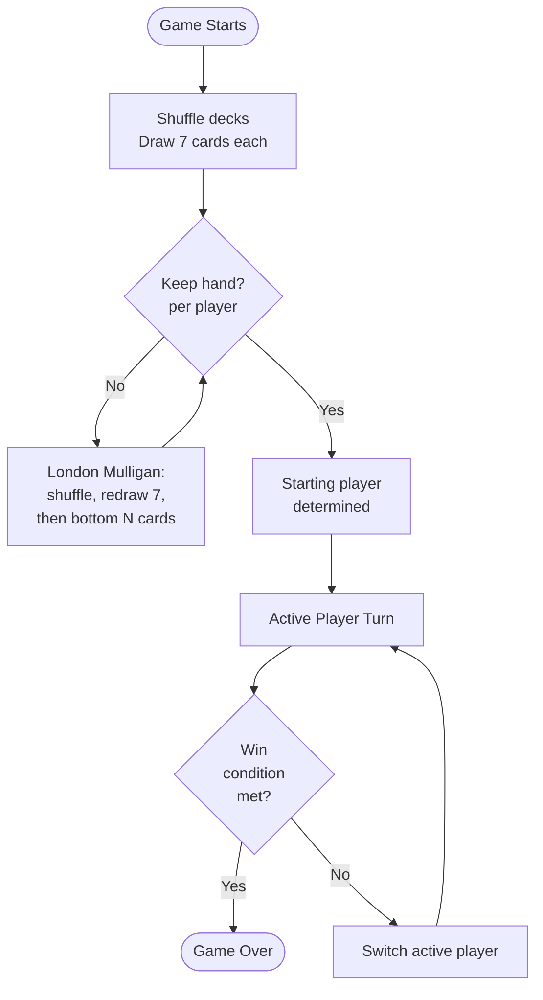
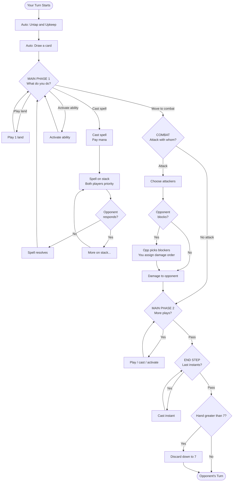
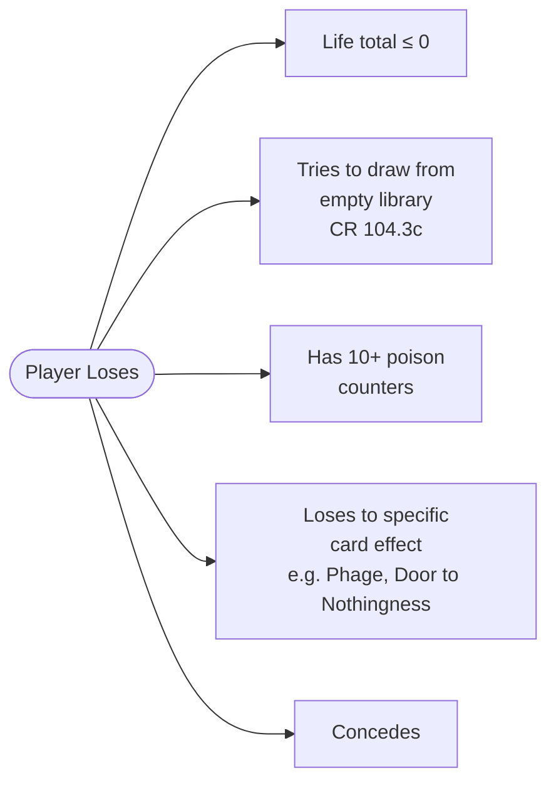
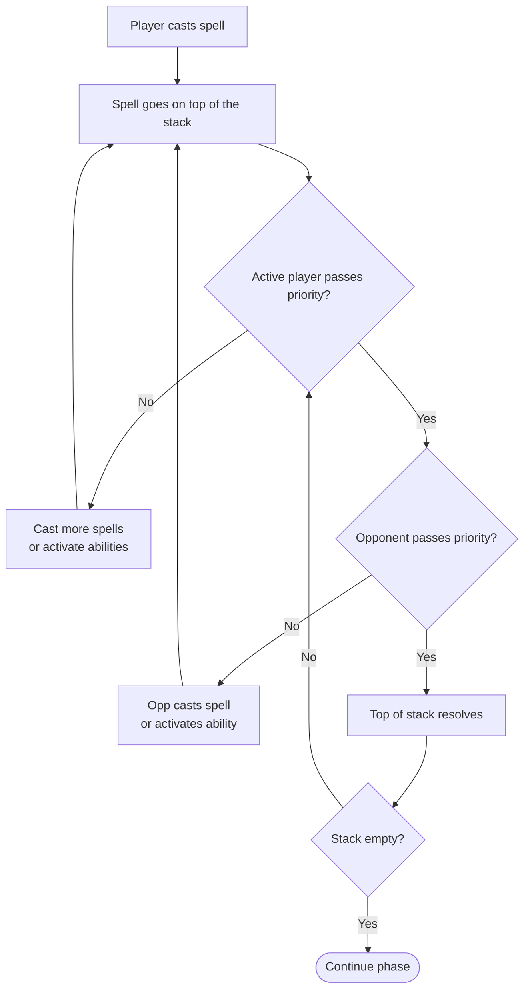
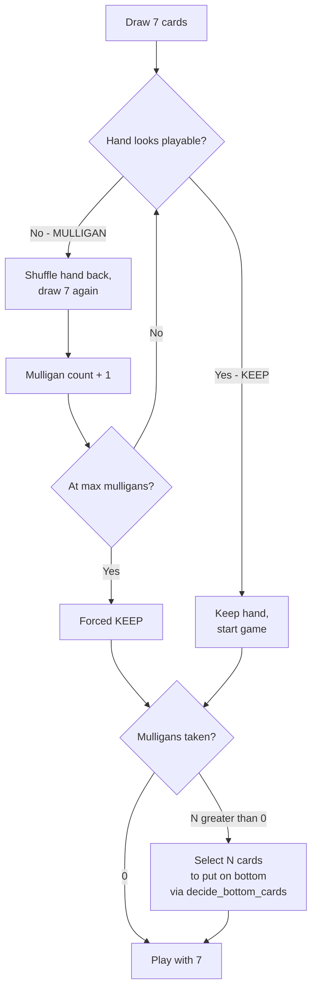

# Magic: The Gathering — Turn Structure (Player's View)

This document explains how a turn flows from the active player's perspective,
matching exactly what our engine simulates in [src/orchestrator/game_runner.py](src/orchestrator/game_runner.py)
and [src/engine/game_simulator.py](src/engine/game_simulator.py).

## High-Level Game Loop

## A Single Turn — Phase by Phase

```mermaid
flowchart TD
    TurnStart([Turn Begins]) --> Beginning[BEGINNING PHASE]
    Beginning --> Untap["1 - UNTAP STEP<br/>Untap your permanents<br/>Remove summoning sickness<br/>Reset land plays = 1<br/>No priority"]
    Untap --> Upkeep["2 - UPKEEP STEP<br/>Triggered abilities trigger<br/>Both players get priority<br/>Cast instants and abilities"]
    Upkeep --> Draw["3 - DRAW STEP<br/>Active player draws 1<br/>Empty library = LOSE<br/>Both players get priority"]

    Draw --> Main1["4 - MAIN PHASE 1<br/>Play 1 land per turn<br/>Cast sorceries<br/>Cast creatures<br/>Activate abilities<br/>Empty stack required to leave"]

    Main1 --> CombatStart[COMBAT PHASE]
    CombatStart --> CBegin["5 - BEGIN COMBAT<br/>Combat triggers fire<br/>Last chance to remove attackers<br/>Both players get priority"]
    CBegin --> Attackers["6 - DECLARE ATTACKERS<br/>Active player picks attackers<br/>Tap attackers unless vigilance<br/>Trigger 'whenever attacks' abilities<br/>Both players get priority"]

    Attackers --> AttackChoice{"Any<br/>attackers?"}
    AttackChoice -- No --> EndCombat["10 - END OF COMBAT<br/>End-of-combat triggers fire"]
    AttackChoice -- Yes --> Blockers["7 - DECLARE BLOCKERS<br/>Defender picks blockers<br/>Set damage assignment order<br/>Both players get priority"]

    Blockers --> Damage["8 - COMBAT DAMAGE<br/>First strike damage first<br/>Then regular damage<br/>Lethal damage destroys<br/>Trample assigns excess<br/>Both players get priority"]
    Damage --> EndCombat
    EndCombat --> Main2

    Main2["9 - MAIN PHASE 2<br/>Same as Main 1<br/>Often used for:<br/>Post-combat plays<br/>Casting big threats<br/>Saving instants for opp turn"]

    Main2 --> EndingPhase[ENDING PHASE]
    EndingPhase --> EndStep["11 - END STEP<br/>'At end of turn' triggers<br/>Last priority window<br/>Last chance for instants"]
    EndStep --> Cleanup["12 - CLEANUP STEP<br/>Empty mana pools<br/>Discard down to 7 cards<br/>Damage wears off creatures<br/>Until-end-of-turn effects end<br/>No priority unless trigger"]

    Cleanup --> TurnEnd([Pass to opponent])
```

Color-coding by phase type:

| Color group | Phases / steps |
|-------------|----------------|
| Beginning   | Untap, Upkeep, Draw |
| Main phases | Main 1, Main 2 |
| Combat      | Begin Combat, Declare Attackers, Declare Blockers, Combat Damage, End Combat |
| Ending      | End Step, Cleanup |

## Decision Points — Where the Agent Acts

This flowchart shows **only the moments where the LLM agent is invoked** —
i.e. when the player must make a choice.

Diamond nodes are **agent decision points**. Everything else is automatic.

## Win Conditions

A player loses when **any** of these occur:

Currently implemented: **L1 (life ≤ 0)** and **L2 (deck out)**. L3, L4 are
forthcoming with full keyword/ability support.

## The Stack — How Spells Resolve

This is the most-confusing-to-newcomers mechanic in MTG:

**Key rule:** Stack resolves **last-in, first-out** (LIFO). To counter the
last spell cast, your counterspell goes on top of the stack and resolves first.

## Mulligan Decision — London Mulligan

This is what the agent's `decide_mulligan()` method handles:

## Heuristics by Strategy — Default Mulligan Logic

When the LLM is unavailable, we fall back to strategy-aware heuristics
(see [src/agents/mulligan.py](src/agents/mulligan.py)):

| Strategy        | Lands range | Other requirements             |
|-----------------|-------------|--------------------------------|
| **AGGRESSIVE**  | 1–3         | At least 2 cheap (CMC ≤ 2) spells |
| **CONTROL**     | 3–5         | At least 1 spell (any CMC)     |
| **COMBO**       | 2–5         | At least 4 spells              |
| **REACTIVE**    | 2–5         | At least 1 cheap spell         |

## Engine ↔ Phase Mapping

How our code maps to the official MTG phases (CR 500–514):

| MTG Phase / Step      | Code (`Phase` enum)      | What our engine does          |
|-----------------------|--------------------------|-------------------------------|
| Untap step            | `Phase.UNTAP`            | Untap, clear sickness, reset land plays |
| Upkeep step           | `Phase.UPKEEP`           | Triggers; priority loop forthcoming |
| Draw step             | `Phase.DRAW`             | Draw 1 card; deck-out check   |
| First main phase      | `Phase.MAIN_1`           | Active player main-phase plays |
| Beginning of combat   | `Phase.COMBAT_BEGIN`     | Initialize combat state       |
| Declare attackers     | `Phase.COMBAT_ATTACKERS` | Priority loop, then attackers declared |
| Declare blockers      | `Phase.COMBAT_BLOCKERS`  | Priority loop, then blockers declared |
| Combat damage         | `Phase.COMBAT_DAMAGE`    | Damage assignment and resolution |
| End of combat         | `Phase.COMBAT_END`       | End-of-combat triggers (placeholder) |
| Second main phase     | `Phase.MAIN_2`           | Same as MAIN_1                |
| End step              | `Phase.END_STEP`         | End-of-turn triggers          |
| Cleanup step          | `Phase.CLEANUP`          | Empty mana, discard to 7      |

---

**Resources:**
- Official Comprehensive Rules: <https://magic.wizards.com/en/rules>
- Section 5: Turn Structure (CR 500–514)
- Section 6: Spells, Abilities, Effects (CR 600–614 — the stack)
- Section 7: Additional Rules (CR 700–728 — combat damage, win conditions)
